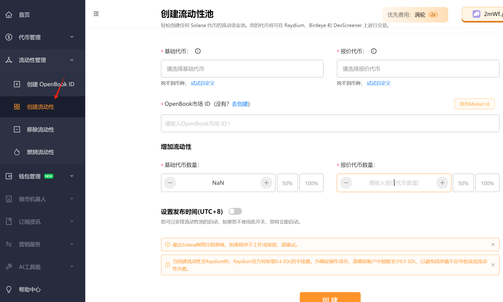
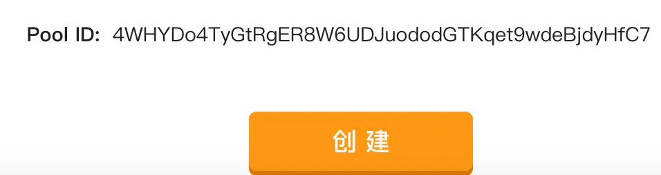

# solana链如何在Raydium加池子
>我们致力于为您提供一个安全可靠的平台，以确保您的隐私得到充分保护，同时不会对您的钱包造成任何伤害,我们的宗旨是**忠于用户**、**服务用户**。我们追求的是**与用户建立长久可靠的信任**。
### Raydium是什么，为什么要去Raydium加池子
Raydium 是 Solana 区块链上的一个去中心化交易平台。Raydium 的加池子功能允许用户将不同的资产配对并提供流动性，以便在 Raydium 上进行交易、做市和挖矿。
加池子的主要作用如下：
- 1.提供流动性：通过将不同的资产配对并存入加池子，用户可以为交易平台提供流动性。这使得其他用户可以在 Raydium 上进行交易，并且能够以较低的滑点和较高的执行效率进行交易。
- 2.交易：通过加池子，用户可以直接在 Raydium 上进行资产的交易。无需借助中间币种，用户可以快速、安全地进行资产的兑换和交换。
- 3.做市：加池子的提供者可以通过做市挖矿获得奖励。当其他用户在 Raydium 上进行交易时，提供流动性的用户将根据其提供的流动性份额获得一定比例的交易手续费。
- 4.挖矿：Raydium 还提供了各种流动性挖矿池，用户可以将资产存入这些挖矿池中，获得额外的代币奖励作为激励。

### 接下来看一下加池子的步骤

1.[创建流动性页面](https://slerf.tools/liquidity-creator/solana)如下图： 

填写代币合约、报价代币(就是交易代币，一般默认SOL)、[openbookid](https://slerf.tools/openbook-market/solana)、以及 [添加代币](https://slerf.tools/token-creator/solana) 的数量和报价代币的数量后。点击创建按钮。

如果还没有代币可以[点此](https://slerf.tools/token-creator/solana)先去创建代币：

没有openbookid可以[点此](https://slerf.tools/openbook-market/solana) 去创建 ：

等待页面唤起钱包点击确认签名后，会显示出池子 ID ：

这个池子id可以保存好，后面如果需要撤池子的时候用得到，如果忘记的话也可以去其他网站比如ave.io 等查的到池子id。