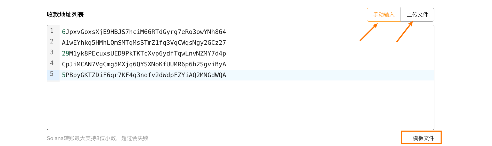

# Solana批量转账(一转多)教程
Solana批量转账 | 批量空投 | 代币批量发送 | 省钱高效
Solana链上最好用的空投工具，批量发送代币，一次交易高效发送到多个钱包，SlerfTools为您安全高效地处理大量转账，转账越多，成本越低！

[SlerfTools-Solana工具集](https://slerf.tools)

>我们致力于为您提供一个安全可靠的平台，以确保您的隐私得到充分保护，同时不会对您的钱包造成任何伤害,我们的宗旨是**忠于用户**、**服务用户**。我们追求的是**与用户建立长久可靠的信任**。

### 如何使用 Solana 批量转账（一转多）工具
1.链接钱包

2.选择要进行批量转账的代币

3.填写多个收款地址（可手动输入或者上传文件）

4.设置一笔交易中包含的转账地址数

5.设置每个地址的转账数量

6.核对批量转账相关数据

7.确认发送上链等待批量转账完成

### 准备事项：
1.一台电脑或者一部手机

2.Solana 钱包（幻影钱包Phantom安装教程）

3.要进行批量转账的代币

4.接收转账的钱包地址

5.一些 SOL 用于支付转账 GAS

### 具体步骤：
1.链接钱包

批量转账：https://slerf.tools/zh-cn/multi-sender/solana

进入 SlerfTools 批量转账页面，右上角支持切换语言。

2.选择要进行批量转账的代币

3.填写多个收款地址（可手动输入或者上传文件）

手动输入：在表格或其他地方复制地址后粘贴即可

上传文件：支持 Excel / CSV / TXT / JSON 类型，可下载模板文件

4.设置每个地址的转账数量

简洁版：可以一次性给所有地址设置相同的转账数量

专业版：可以给每个地址设置不同的转账数量，地址和数量之间用英文逗号隔开

建议在 Excel 等编辑器中编辑好每个地址的转账数量后上传文件

5.设置一笔交易中包含的转账地址数，建议：

 转Sol：19

 接收过转账Token的地址：19

 未接收过转账Token的地址：9

一笔交易中可以包含多个转账，仅需支付一次 GAS 费用，但是超出转账地址数将会失败。

6.核对批量转账相关数据

核对将要进行的批量转账的【地址总数】、【代币发送总数】和收款地址及对应数量信息

7.发送上链等待批量转账完成

如果有转账失败地址可以快捷进行复制

Solana上每个Token或NFT都需在首次获取时支付一定的SOL作为账户租金。

批量转账中，成本较高的部分为给未持有过该代币的地址支付账户租金，每个新地址约 0.002 SOL。查看SOLANA账户模型

无需担心，通过几个简单的步骤，批量销毁您任何不需要的代币并回收 SOL 租金。

批量关闭账户-回收Solana

SlerfTools | 创建代币、批量空投和做市机器人等Solana工具集

安全、开源，给Solana用户带来最便利的一站式体验。
