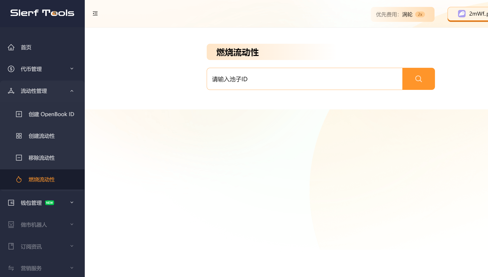
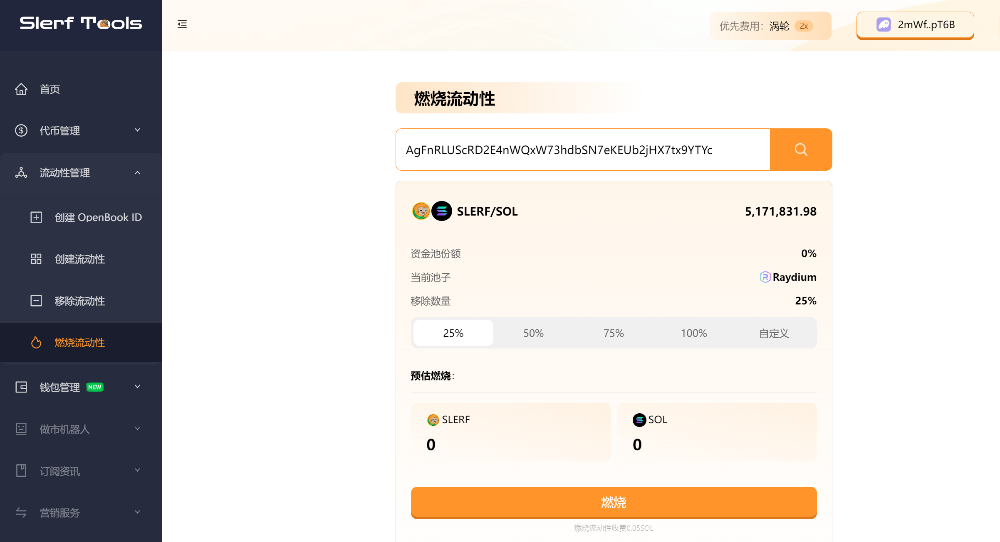

# solana链如何燃烧raydium池子
>我们致力于为您提供一个安全可靠的平台，以确保您的隐私得到充分保护，同时不会对您的钱包造成任何伤害,我们的宗旨是**忠于用户**、**服务用户**。我们追求的是**与用户建立长久可靠的信任**。

### 我们为什么要燃烧raydium池子？
在 Raydium 中，燃烧池子（Burn Pools）是指用于销毁（燃烧）代币的特殊池子。燃烧池子的主要目的是通过销毁代币来减少总供应量，从而实现通缩效果。
燃烧池子的意义和好处如下：
- 通缩机制：通过销毁代币，燃烧池子可以减少代币的供应量。通缩有助于提高代币的稀缺性，从而可能增加其价值。这可以为持有者带来潜在的价值增长和投资回报。
- 市场需求：燃烧池子可以满足市场对通缩代币的需求。许多投资者和交易者寻求具有通缩机制的代币，因为这通常被视为抵御通货膨胀和增加长期价值的方式。
- 市场激励：燃烧池子通常与流动性挖矿或其他奖励机制相结合。通过将代币存入燃烧池子参与挖矿，用户可以获得额外的奖励。这种激励机制可以吸引更多的用户参与和持有代币。
- 市场调节：燃烧池子可以用于调节代币的供应和需求。根据市场情况和项目的经济模型，团队可以决定何时启动或停止燃烧池子，以平衡供需关系并调整代币的流通量

### 接下来我们来演示燃烧池子的示例

[点此进入燃烧流动性页面](https://slerf.tools/lp/burn)如下图

输入池子id，如果没有池子可以[点击此处](https://slerf.tools/lp/add)创建池子：

点击查询出现池子的详细信息如下图：

然后选择移除的数量，点击燃烧即可完成

##  疑问解答
### 如何获取池子ID？
- 获取池子 ID有以下几种方式
- 1. 在 Raydium 创建流动性成功后，页面会显示 AMM ID，这个就是池子ID
- 2. 在 https://rugcheck.xyz/ 网站输入您的代币地址，Raydium标记的地址栏对应的地址即池子ID。
- 3. 在 https://avedex.cc/ 网站输入您的代币地址，池子后面对应的地址即池子ID。
- 4. 在 solana 浏览器 https://solscan.io/ 找到您创建流动性的交易，