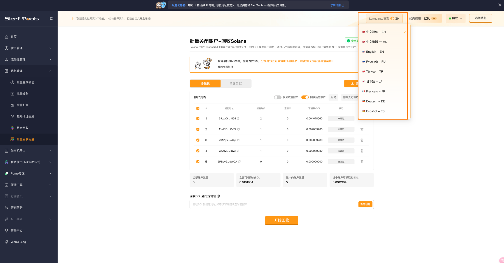
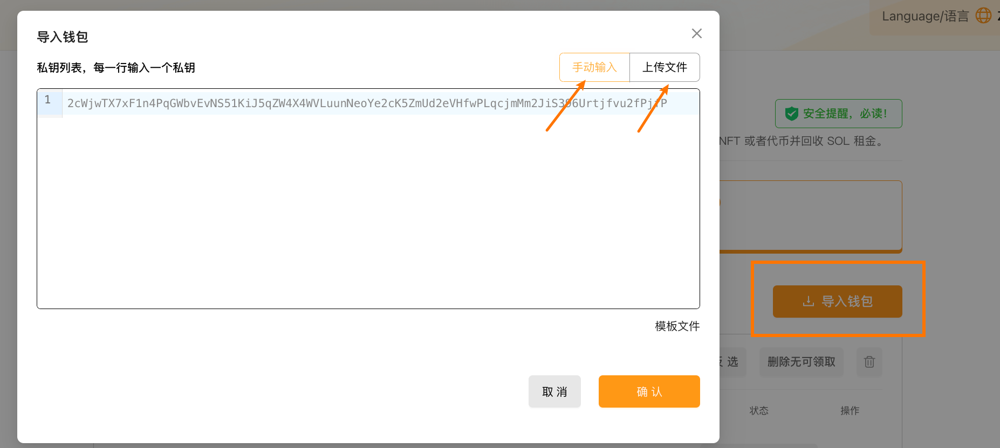
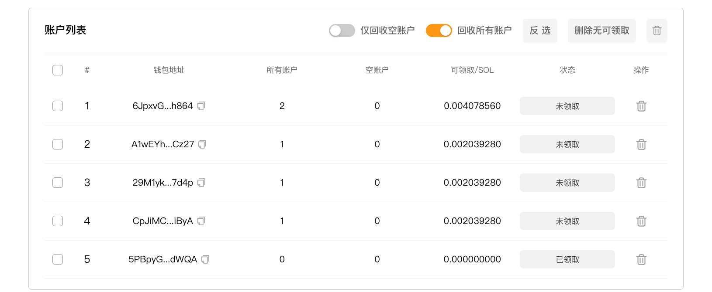
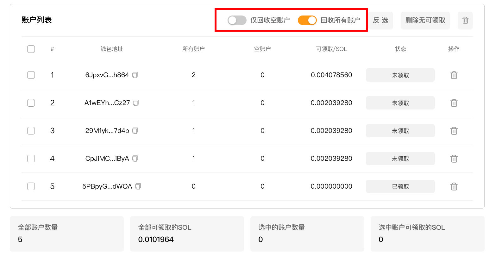
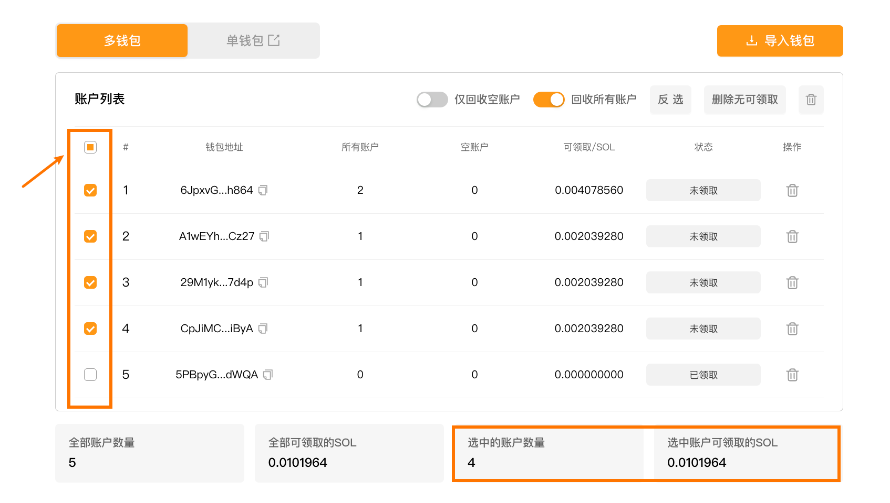
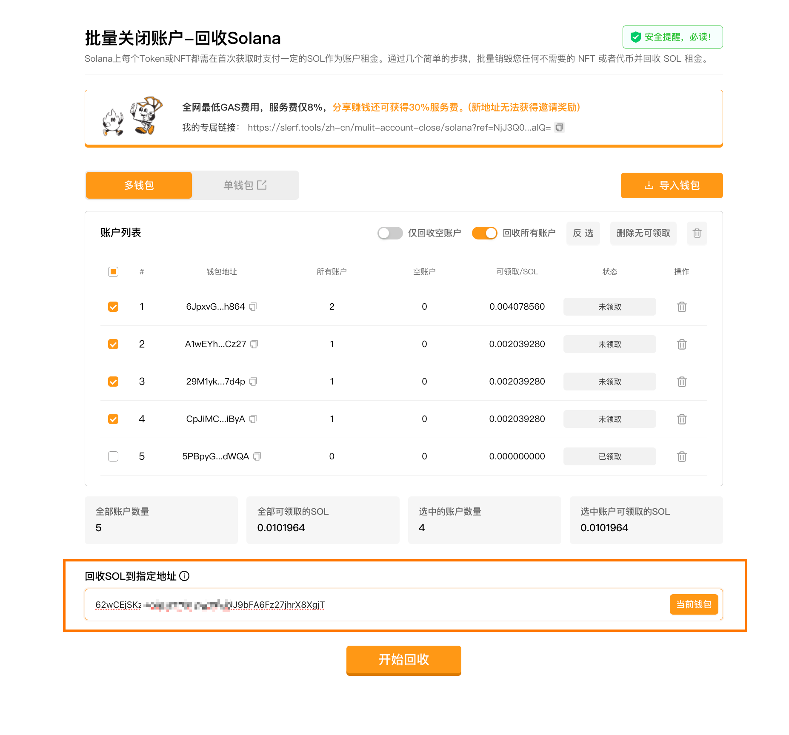
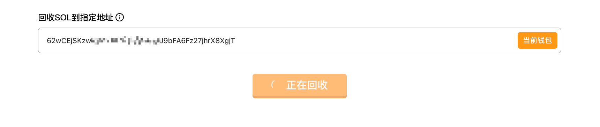

# 批量回收租金-领取您的Solana
Solana关闭账户 | 批量回收账户租金 | 领取您的Solana
在 Solana 上，每个 Token 或 NFT 都需支付 SOL 租金。通过简单步骤，批量销毁不需要的 NFT 或代币，快速回收账户租金。

全网最低GAS费用，服务费仅8%，分享赚钱还可获得30%服务费。

[SlerfTools-Solana工具集](https://slerf.tools)

>我们致力于为您提供一个安全可靠的平台，以确保您的隐私得到充分保护，同时不会对您的钱包造成任何伤害,我们的宗旨是**忠于用户**、**服务用户**。我们追求的是**与用户建立长久可靠的信任**。

### 如何使用 Solana 批量关闭账户，回收租金工具
1.打开 SlerfTools 批量回收Solana 页面

2.导入需要回收的钱包

3.查看已导入钱包的账户信息

4.选择要回收的账户类型

5.选择要回收的钱包

6.填写回收 SOL 的收款地址

7.确认回收发送上链等待批量回收完成

### 准备事项：
1.一台电脑或者一部手机

2.Solana 钱包（幻影钱包Phantom安装教程）

3.历史接收过代币的钱包

4.需要回收租金的钱包地址私钥

5.一些 SOL 用于支付链上 GAS

### 具体步骤：
1.打开 SlerfTools 批量回收租金页面

Solana批量回收租金：https://slerf.tools/zh-cn/batch-incinerator/solana

进入 SlerfTools 批量回收租金页面，右上角支持切换语言。

2.导入需要回收的钱包

 手动输入：在表格或其他地方复制私钥后粘贴即可

 上传文件：支持 Excel / CSV / TXT / JSON 类型，可下载模板文件

3.查看已导入钱包的账户信息。

钱包地址、所有账户数量、空账户数量、预估可回收领取的 SOL 数量

4.选择要回收的账户类型

 空账户：都是余额为0，没有任何用处的，请放心领取。关闭不会对钱包使用有任何的影响。

 所有账户：包含空账户、代币账户、NFT 账户、域名，燃烧过程不可逆，所以一定要确认要关闭的代币账户是否还有价值。

5.选择要回收的钱包

6.回收SOL到指定钱包地址（选填）

回收 SOL 到指定钱包地址仅需支付 1 次 GAS，回收时会自动修改为用户指定的地址接收租金，降低成本，无需浪费 GAS 二次归集。

如果不填写则默认回收租金 SOL 至对应钱包

7.确认回收发送上链等待批量回收完成

回收前需要确保待回收账户中有一些 SOL 用于支付链上 GAS，如无 GAS 将会回收失败。

>安全提醒：

保护私钥：SlerfTools只在本地计算并用于签署交易，绝不收集或上传您的私钥或敏感信息。

如果回收所有账户，所有代币都将被销毁，无法撤销。请确保代币已经没有价值!

回收的SOL是通过关闭存储该代币的帐户来实现的，无论帐户持有1个还是100,000个代币，回收金额都是相同的。

预估可收回金额可能与实际回收的金额有所差异，请以交易执行后的实际结果为准。

SlerfTools | 创建代币、批量空投和做市机器人等Solana工具集

安全、开源，给Solana用户带来最便利的一站式体验。
