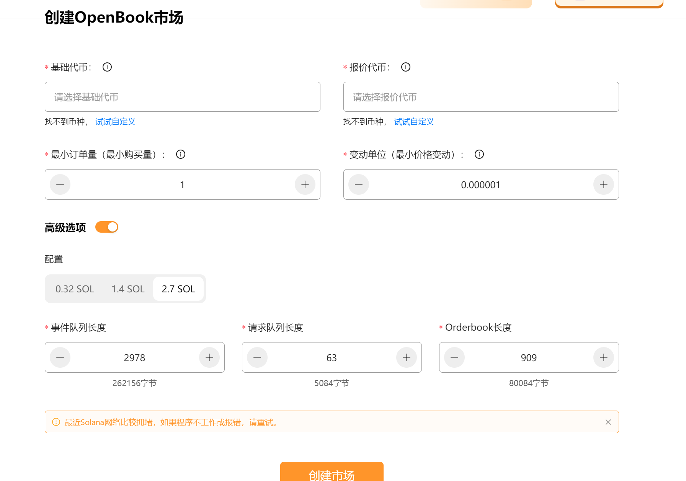
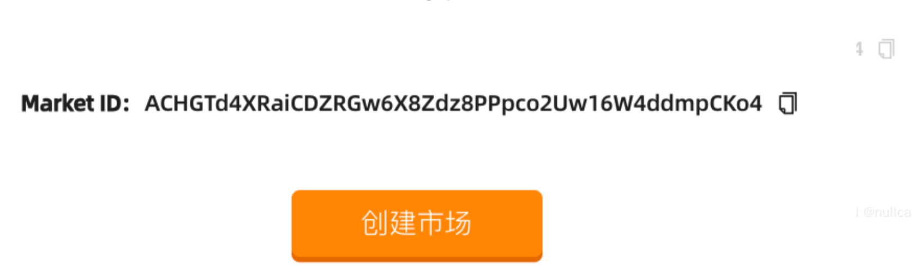
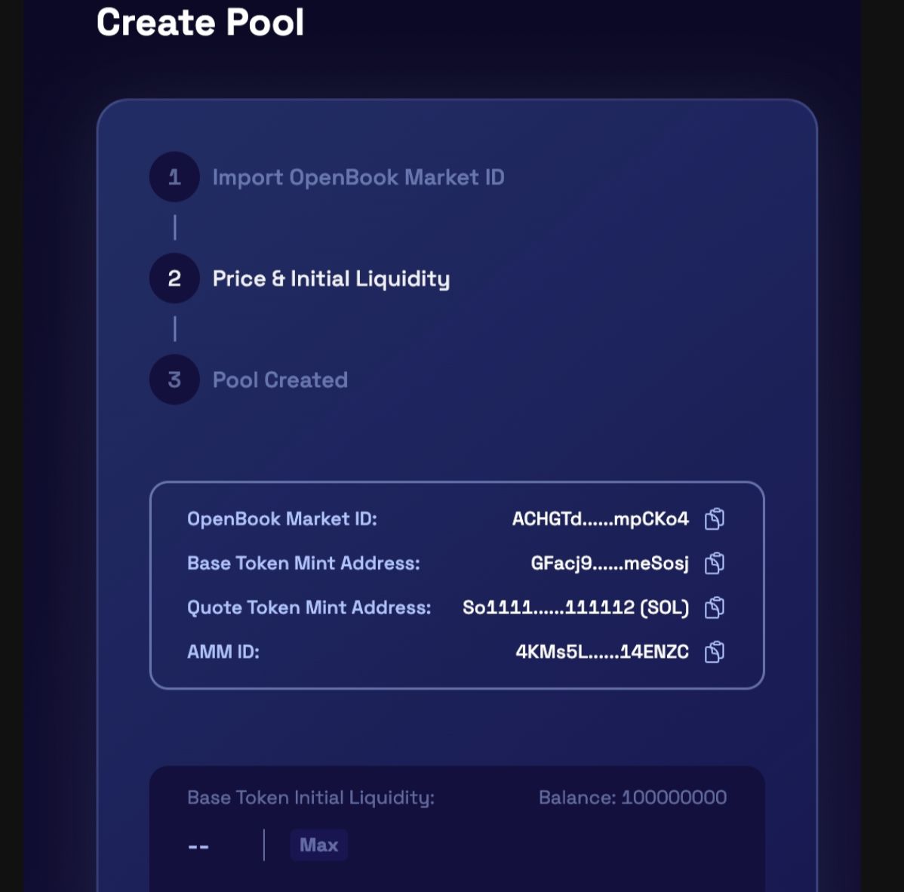

# solana链创建openbookId
>我们致力于为您提供一个安全可靠的平台，以确保您的隐私得到充分保护，同时不会对您的钱包造成任何伤害,我们的宗旨是**忠于用户**、**服务用户**。我们追求的是**与用户建立长久可靠的信任**。

### 为什么需要创造openid？
Raydium 是 Solana 区块链上的一个去中心化交易平台，而 OpenBook Market ID 是指在创建 Raydium 加池子时所需的 OpenBook 市场标识。
OpenBook 是 Raydium 的子项目，它允许用户创建自定义的做市池（AMM）并提供流动性。当您在 Raydium 上创建加池子时，需要指定 OpenBook Market ID，以确定要与之配对的资产和市场。这个 Market ID 是 OpenBook 池子的唯一标识符，它将与您创建的加池子相关联，以确保正确的流动性配对和交易。
因此，在创建 Raydium 加池子时，需要提供 OpenBook Market ID，以便正确设置和连接到相应的 OpenBook 市场。

### 创建openBookId
打开工具[网页](https://slerf.tools/openbook-market/solana) 
填写需要创建的代币,如果还没有代币，可以点击此[链接](https://slerf.tools/token-creator/solana)先创建代币 。

依次填写**基础代币** **报价代币** **最小订单量**等参数，点击创建市场

所有的参数填写完成后，点击创建市场按钮，钱包确认交易后稍等一会链上交易确认后，网页下方会出现市场ID

在[raydium官方网站](https://raydium.io/liquidity/create/)创建流动性页面输入Market ID可以查到信息表示创建成功

创建完openbookid之后，可以继续[添加流动性](https://slerf.tools/liquidity-creator/solana)

### 配置参数建议
最小订单量和变动单位可以根据代币供应量来配置，下面是建议值：

| 代币供应量 | 最小订单量 | 变动单位         |
| ----- | ----- | ------------ |
| 100K  | 0.01  | 0.0001       |
| 1M    | 0.1   | 0.00001      |
| 10M   | 1     | 0.000001     |
| 100M  | 10    | 0.0000001    |
| 1B    | 100   | 0.00000001   |
| 10B   | 1000  | 0.000000001  |
| 100B  | 10000 | 0.0000000001 |
