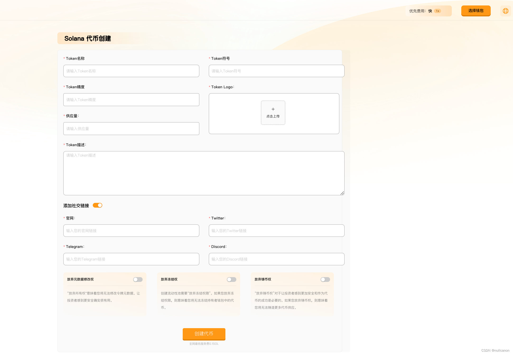
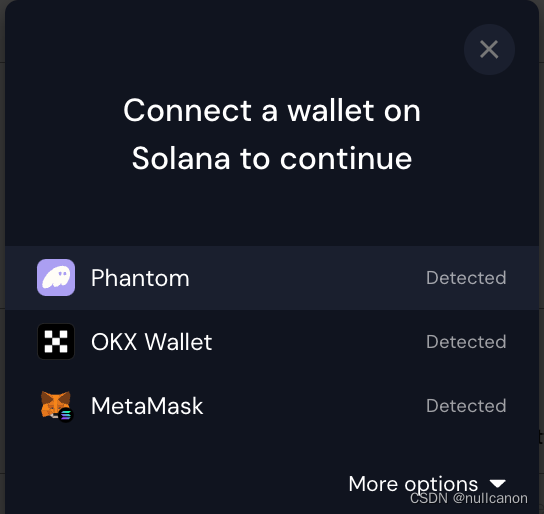
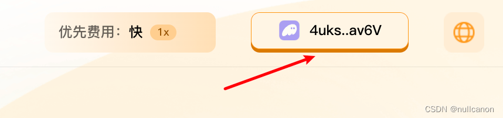
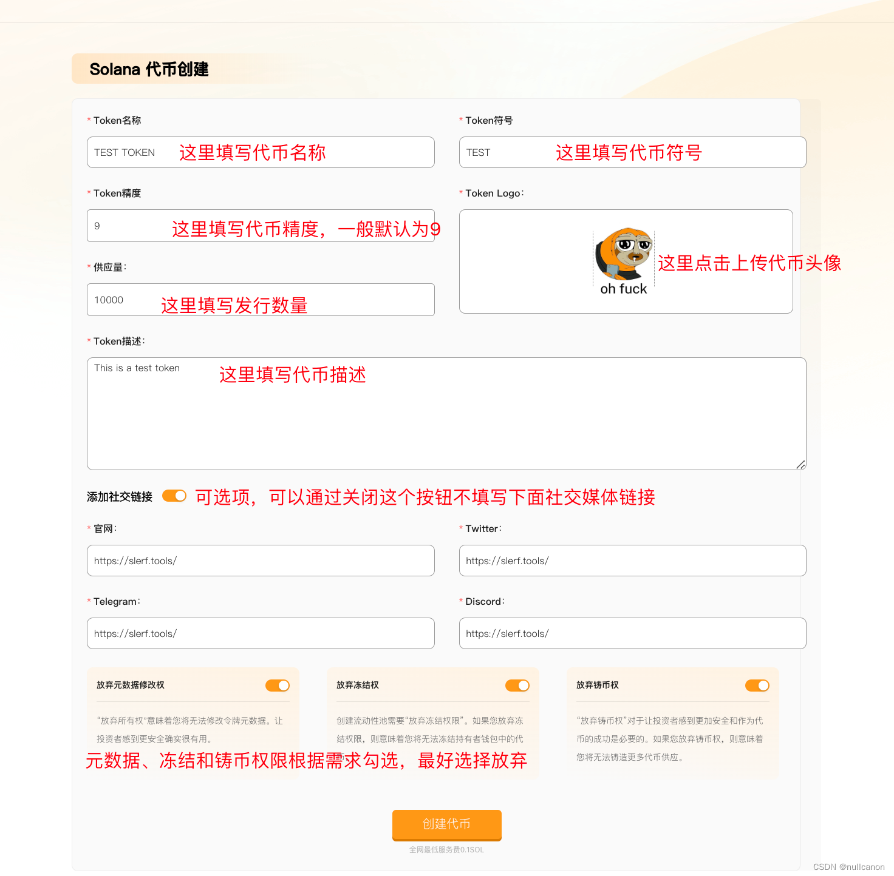
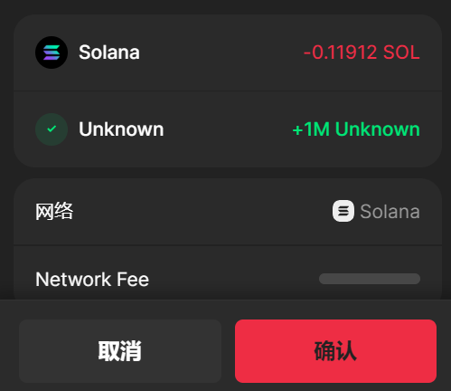
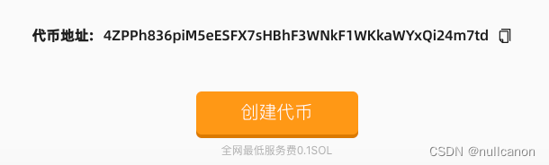
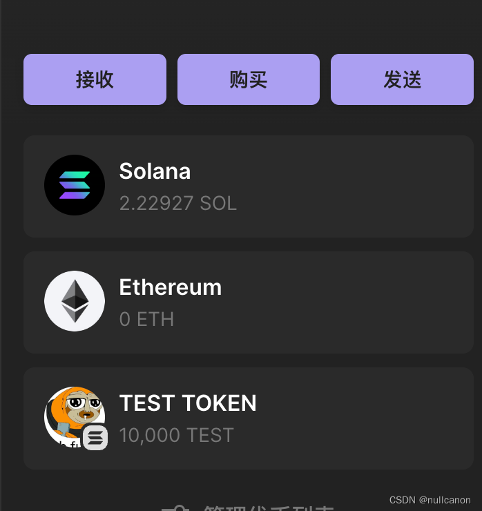
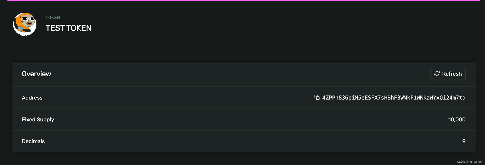

# Solana创建代币教程
Solana 一键发币，快速、方便、廉价。只需要花费 0.13 SOL。

[SlerfTools-Solana工具集](https://slerf.tools)

>我们致力于为您提供一个安全可靠的平台，以确保您的隐私得到充分保护，同时不会对您的钱包造成任何伤害,我们的宗旨是**忠于用户**、**服务用户**。我们追求的是**与用户建立长久可靠的信任**。

只需要 1 分钟就可以创建自己的SOLANA代币 

1. 钱包最少准备 0.15 SOL

2. 连接Solana钱包 

3. 填写代币信息创建 

4. 创建成功 

Solana 是一个基于区块链技术的高性能、去中心化的智能合约平台，旨在为开发者提供高度可扩展和低成本的区块链基础设施。通过其创新的共识机制和高吞吐量的网络架构，Solana 实现了每秒数千次交易的处理能力，同时保持低延迟和低交易成本，为开发者和用户带来了无与伦比的区块链体验。

SLEFR创始人和开发团队联合推出了全网最低服务费的Solana工具箱 [SlerfTools](https://slerf.tools)，只需要一分钟就可以在Solana链上发行SPL代币了。

- 连接钱包 

- 上传数据 

- 一键发币

### 1. 链接Solana钱包
SlerfTools 目前支持多种流行的Solana钱包，例如Solflare、Phantom、ok钱包等。本文以Phantom钱包为例进行说明。

点击这里进入[工具](https://slerf.tools/token-creator/solana)，点击网页右上角语言选择中文如下图所示：

点击右上角的【选择钱包】按钮，在弹出窗口中选择你使用的钱包，钱包里面需要有 0.15 SOL用作支付：

连接后可以看到右上角显示的钱包地址

### 2. 填写代币信息创建
填写代币资料信息，接下来我们发行 10,000 枚叫TEST的测试代币：

填写完成后，点击创建代币按钮按照提示点击钱包确认交易：

### 3. 创建成功
创建成功后网页下方可以看到代币地址：

钱包和浏览器也可以看到创建出来的代币：

##  疑问解答
### 1、Solana上发币需要合约开源吗？
- 答：不需要，Solana上的代币是通过官方发布好的合约创建出来的账户，所有的SPL20代币都用的是同一的合约。

### 2、为什么钱包不显示 logo？
- 答：Phantom钱包有时候信息有延迟，需要耐心等待一段时间。可以在Solana浏览器上搜索代币信息进行查看。

### 3、什么情况下丢弃权限？
- 答：一般情况下，在需要在 Raydium 添加的代币需要放弃冻结和铸币权限，元数据修改权限可以自行选择，如果放弃元数据权限，那么代币名称和logo将不能更新。

### 4、上传logo需要收费吗？
- 答：不需要，本平台采用的是 IPFS 的存储方案，完全免费。