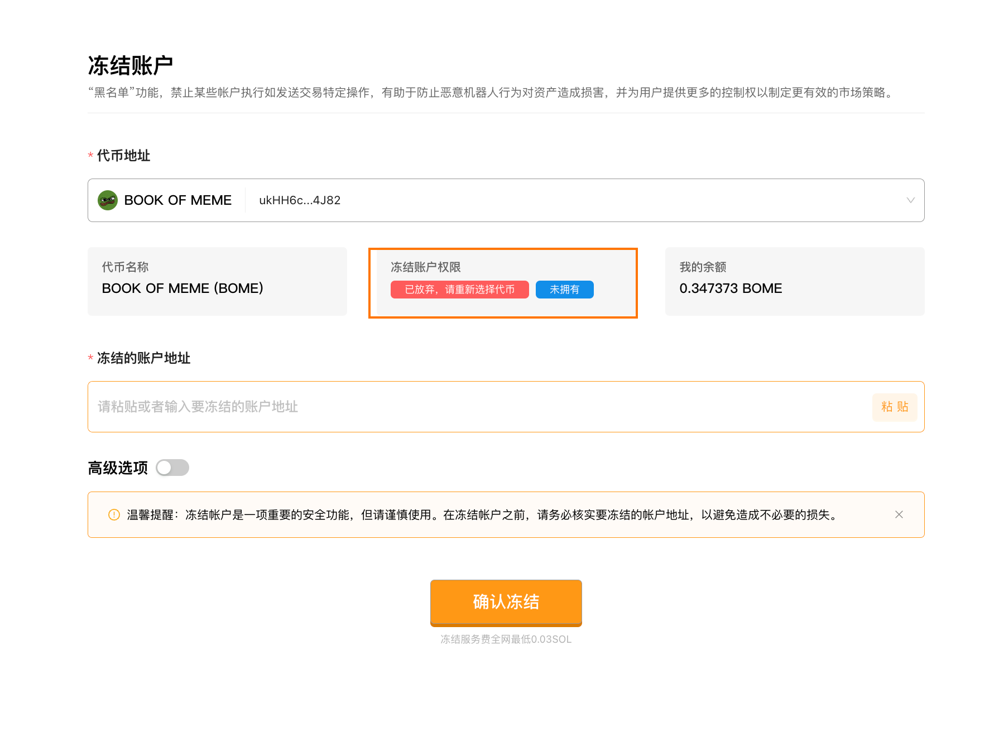

# Solana代币冻结账户教程
>“黑名单”功能，禁止某些帐户执行如发送交易特定操作，有助于防止恶意机器人行为对资产造成损害，并为用户提供更多的控制权以制定更有效的市场策略。

[SlerfTools-Solana工具集](https://slerf.tools)

>我们致力于为您提供一个安全可靠的平台，以确保您的隐私得到充分保护，同时不会对您的钱包造成任何伤害,我们的宗旨是**忠于用户**、**服务用户**。我们追求的是**与用户建立长久可靠的信任**。

### 如何使用 Solana 冻结账户工具：
链接钱包

选择或输入要冻结的代币合约地址

检索代币相关权限信息

粘贴或输入要冻结的账户地址

提交上链完成账户冻结

### 准备事项：
一台电脑或者一部手机

Solana 钱包（幻影钱包Phantom安装教程）

钱包最少准备 0.03 SOL

要冻结的代币合约和要冻结的账户地址信息

### 具体步骤：
1. 链接钱包

SlerfTools 目前支持多种流行的Solana钱包，例如Solflare、Phantom、ok钱包等。本文以Phantom钱包为例进行说明。

Solana冻结账户：https://slerf.tools/zh-cn/freeze-account/solana

进入 SlerfTools 代币克隆页面，右上角支持切换语言。

2.选择或输入要冻结的代币合约地址

3.检索代币相关权限信息，判断是否可以冻结

冻结权限未放弃，同时当前链接钱包是所选代币的管理者，可以冻结，如下图所示：

冻结权限已放弃，同时当前链接钱包不是管理者，无法冻结

冻结权限未放弃，但是当前链接钱包不是管理者，无法冻结

4.粘贴或输入要冻结的账户地址
输入后会显示对应地址的代币余额和目前冻结状态

5.查询持币地址
可在第三方行情平台，查看代币的最近交易记录买入地址，或者链上查看代币的持仓地址

AVE（https://ave.ai/）

链上查看（https://solscan.io/）

6.开启高级选项，启用 Jito 小费提升冻结上链速度

7.提交上链完成账户冻结

>温馨提醒：冻结帐户是一项重要的安全功能，但请谨慎使用。在冻结帐户之前，请务必核实要冻结的帐户地址，以避免造成不必要的损失。

SlerfTools | 创建代币、批量空投和做市机器人等Solana工具集

安全、开源，给Solana用户带来最便利的一站式体验。
