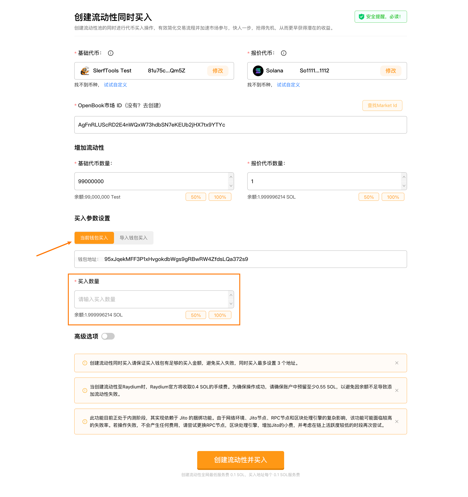
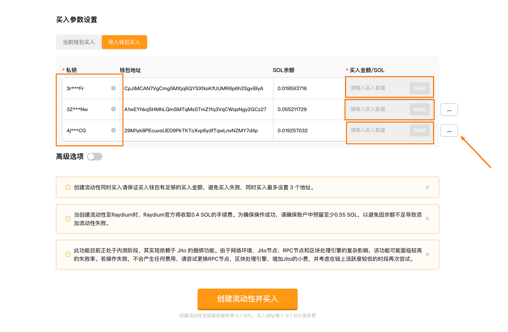
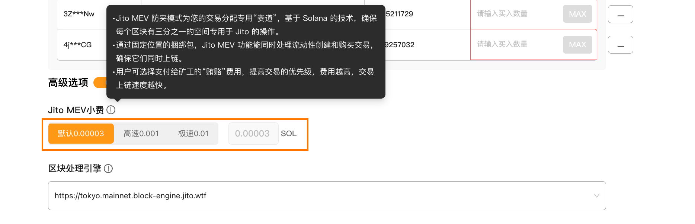

# Solana创建流动性并买入教程
创建流动性池的同时进行代币买入操作，有效简化交易流程并加速市场参与，快人一步，抢得先机，从而更早获得潜在的收益。

[SlerfTools-Solana工具集](https://slerf.tools)

>我们致力于为您提供一个安全可靠的平台，以确保您的隐私得到充分保护，同时不会对您的钱包造成任何伤害,我们的宗旨是**忠于用户**、**服务用户**。我们追求的是**与用户建立长久可靠的信任**。

### 如何使用 Solana 创建流动性池并买入工具（Raydium V2）：

1.链接钱包

2.选择要创建流动性池的交易对

3.检索所选交易对的 OpenBook 市场 ID

4.填写要创建流动性池要添加的代币数量

5.买入参数设置，选择当前钱包或导入钱包买入

6.设置开盘时要买入的数量，100%最早买入

7.提交上链完成创建流动性同时买入

### 准备事项：

1.一台电脑或者一部手机

2.Solana 钱包（幻影钱包Phantom安装教程）

3.钱包最少准备 0.5 SOL (Raydium官方将收取0.4 SOL)

4.要创建流动性池的代币和OpenBook 市场 ID

5.要买入的地址私钥和一些 SOL

### 具体步骤：

1.链接钱包

2.选择要创建流动性池的交易对

3.检索所选交易对的 OpenBook 市场 ID

4.填写要创建流动性池要添加的代币数量

以上创建流动性池步骤详情可以参考 Solana创建流动性池教程

5.买入参数设置，支持当前钱包或导入钱包买入

 当前钱包买入时，填写买入数量即可

导入钱包买入

为了保证 100%捆绑买入成功率，最大支持导入 3 个地址捆绑买入

默认有 3 个钱包地址输入框，如果仅需要 1 个或者 2 个地址买入，删除多余地址输入框

6.高级选项（选填），提高上链速度和成功率

7.提交上链完成创建流动性同时买入

创建流动性和买入是捆绑在一起的，如果创建流动性池失败，买入不会成功，同理，如果买入失败，创建流动性池也是不会成功了，所以如果失败可以多次尝试，仅仅会消耗小额 GAS 费用。

>此功能实现依赖于 Jito 的捆绑功能。由于网络环境、Jito节点、RPC节点和区块处理引擎的复杂影响，该功能可能面临较高的失败率。若操作失败，不会产生任何费用，请尝试更换RPC节点，区块处理引擎，增加Jito的小费，并考虑在链上活跃度较低的时段再次尝试。

SlerfTools | 创建代币、批量空投和做市机器人等Solana工具集

安全、开源，给Solana用户带来最便利的一站式体验。
