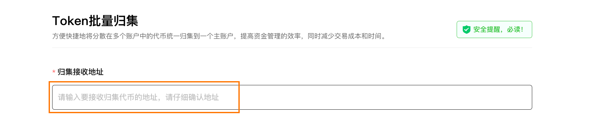

# Solana批量归集(多转一)教程
Solana批量归集 | 多账户资金回收 | 高效资金管理

方便快捷地将分散在多个账户中的代币统一归集到一个主账户，提高资金管理的效率，同时减少交易成本和时间。

[SlerfTools-Solana工具集](https://slerf.tools)

>我们致力于为您提供一个安全可靠的平台，以确保您的隐私得到充分保护，同时不会对您的钱包造成任何伤害,我们的宗旨是**忠于用户**、**服务用户**。我们追求的是**与用户建立长久可靠的信任**。

### 如何使用 Solana 批量归集（多转一）工具

1.链接钱包

2.输入要接收归集代币的收款地址

3.选择要进行批量归集的代币

4.导入需要归集的钱包地址（可手动输入或者上传文件）

5.设置要归集的代币数量

6.再次确认要接收归集代币的地址

7.复核批量归集相关数据

8.确认开始归集发送上链等待批量归集完成

### 准备事项：

1.一台电脑或者一部手机

2.Solana 钱包（幻影钱包Phantom安装教程）

3.要接收归集代币的收款地址

4.需要归集的钱包地址私钥

5.需要归集的地址中有一些 SOL 用于支付转账 GAS

### 具体步骤：

1.链接钱包

批量归集：https://slerf.tools/zh-cn/multi-collector/solana

进入 SlerfTools 批量归集页面，右上角支持切换语言。

2.输入要接收归集代币的收款地址

链上行为不可逆，一定要仔细检查

3.选择或通过代币合约搜索要进行批量归集的代币

4.导入需要归集的钱包地址，选择要归集的钱包地址

手动输入：在表格或其他地方复制私钥后粘贴即可

上传文件：支持 Excel / CSV / TXT / JSON 类型，可下载模板文件

5.设置要归集的代币数量

 全部数量

 保留固定余额

 自定义数量

6.再次确认要接收归集代币的地址

链上行为不可逆，一定要仔细检查

7.开启高级选项，启用 Jito 小费提升归集上链速度（可选）

8.复核批量归集相关数据

9.确认开始归集发送上链等待批量归集完成

>安全提醒：

保护私钥：SlerfTools只在本地计算并用于签署交易，绝不收集或上传您的私钥或敏感信息。

小额钱包推荐：建议使用小额钱包进行操作，避免存放大额资金。

安全复制私钥：复制私钥时，请打乱顺序并分段复制，以防止剪贴板数据被恶意软件监控。

官方不索要私钥：SlerfTools绝不会要求您提供私钥信息，请保持警惕。

SlerfTools | 创建代币、批量空投和做市机器人等Solana工具集

安全、开源，给Solana用户带来最便利的一站式体验。
