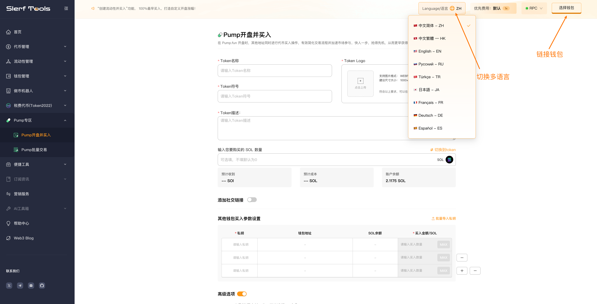
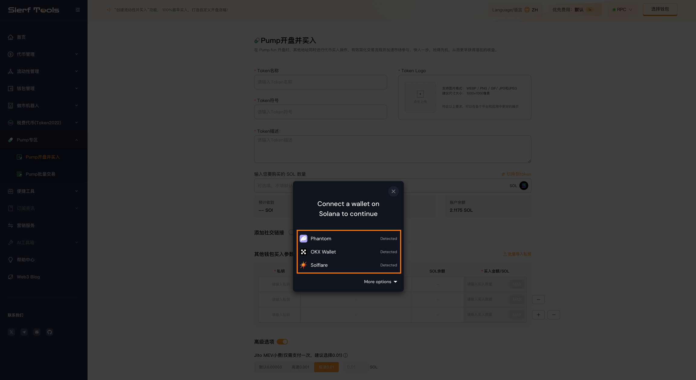
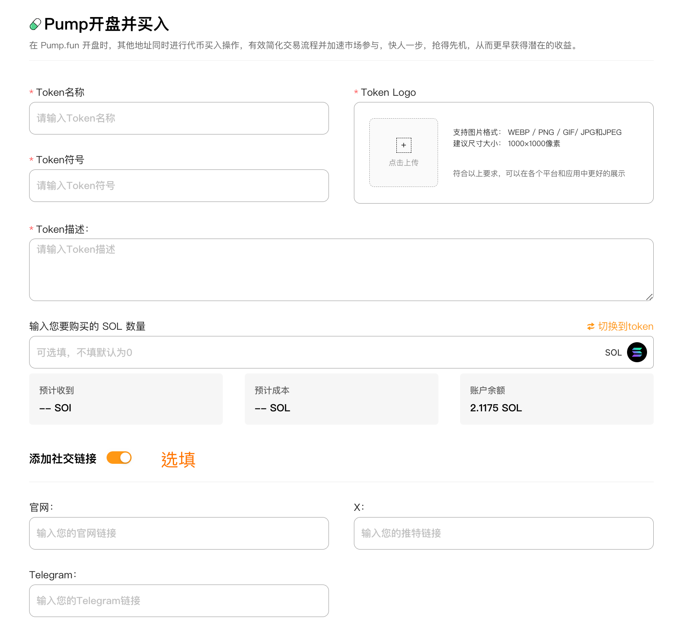
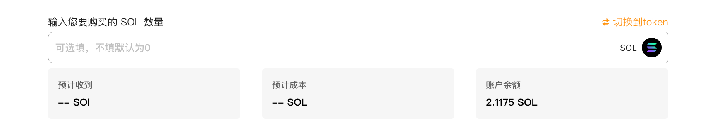
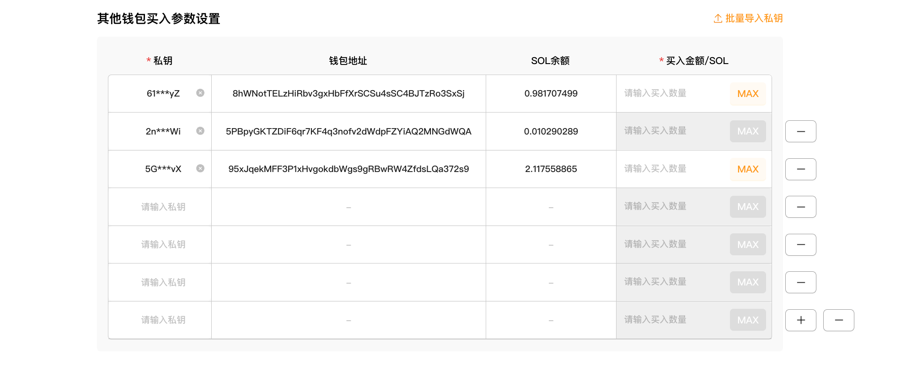
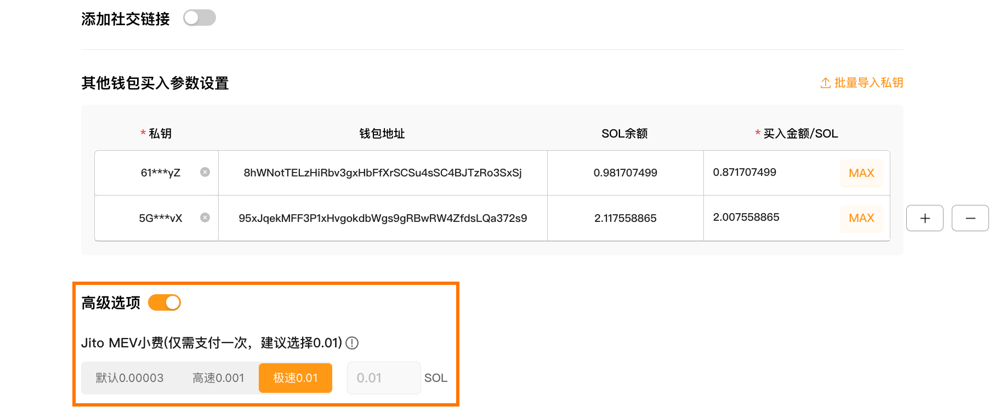
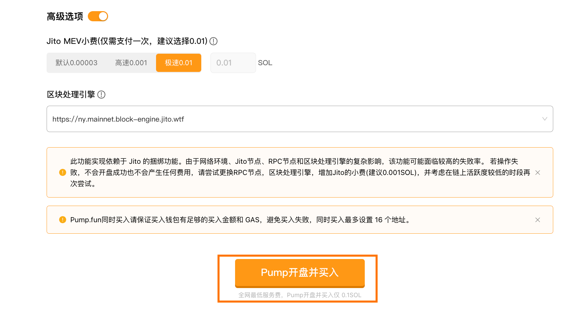
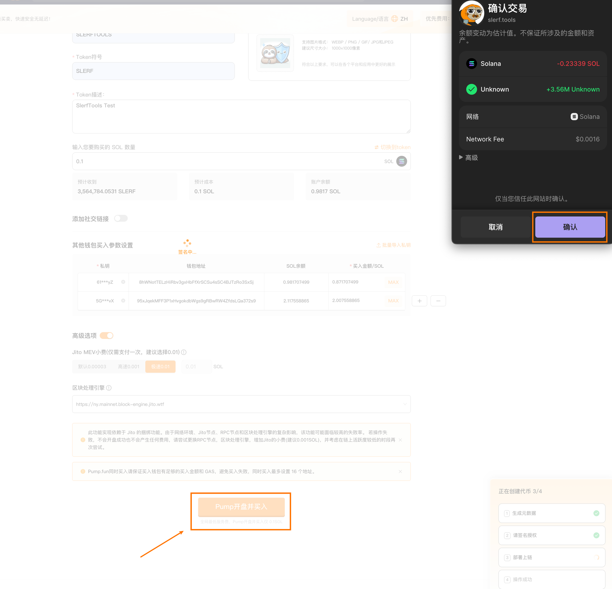

# Pump开盘并买入教程
Pump开盘并买入 | 自定义开盘涨幅 | 多地址隐藏交易

SlerfTools创新功能，PumoFun开盘时，捆绑其他地址100%最早买入，自定义开盘涨幅，多地址隐藏交易，更早获得潜在的收益。

[立即体验>>>](https://slerf.tools/zh-cn/pump-launch-and-buy-token/solana)

>我们致力于为您提供一个安全可靠的平台，以确保您的隐私得到充分保护，同时不会对您的钱包造成任何伤害,我们的宗旨是**忠于用户**、**服务用户**。我们追求的是**与用户建立长久可靠的信任**。

## 如何使用 Pump.fun 开盘并买入工具：
1.链接钱包

2.输入您希望为代币设置的名称(项目全称)

3.填写代币符号，最多10个字符（代币简称）

4.上传代币的Logo图片

5.填写您希望对外展示的代币描述

6.输入您当前钱包想要购买的金额（选填）

7.添加代币描述和社交链接（选填）

8.其他钱包买入参数设置，最大支持 16 个钱包，100%最早买入

9.Jito 小费设置（选填）

10.提交上链完成Pump 开盘并同时买入

### 准备事项：
1.一台电脑或者一部手机

2.Solana 钱包（幻影钱包Phantom安装教程）

3.钱包最少准备 0.1 SOL (Pump官方将收取0.02 SOL)

4.代币的相关信息和 Logo

5.要买入的地址私钥和一些 SOL

### 具体步骤：
1. 链接钱包

SlerfTools 目前支持多种流行的Solana钱包，例如Solflare、Phantom、ok钱包等。本文以Phantom钱包为例进行说明。

Pump开盘并买入：https://slerf.tools/zh-cn/pump-launch-and-buy-token/solana

进入 SlerfTools Pump开盘并买入页面，右上角支持切换语言。

2.填写代币相关信息

3.输入您当前钱包想要购买的金额（选填）

4.其他钱包买入参数设置

可手动导入或者批量导入私钥（最大支持 16 个地址，100%最早买入）

导入后设置每个钱包要买入的 SOL 金额（钱包余额需 ≥ 0.1 SOL）

默认有 3 个钱包地址输入框，如果仅需要 1 个或者 2 个地址买入，删除多余地址输入框

5. Jito 小费设置（选填）

Jito 小费可以简单理解为用户选择支付给矿工的“贿赂”费用，提高交易的优先级，费用越高，交易上链速度越快。

6.提交上链完成 Pump 开盘并同时买入

 生成元数据

 签名上链

 链上部署并交易

此功能实现依赖于 Jito 的捆绑功能。由于网络环境、Jito节点、RPC节点和区块处理引擎的复杂影响，该功能可能面临较高的失败率。 若操作失败，不会开盘成功也不会产生任何费用，请尝试更换RPC节点，区块处理引擎，增加Jito的小费(建议0.01SOL)，并考虑在链上活跃度较低的时段再次尝试。

Pump.Fun开盘同时买入请保证买入钱包有足够的买入金额和 GAS，避免买入失败，同时买入最多设置 16 个地址。

SlerfTools | 创建代币、批量空投和做市机器人等Solana工具集

安全、开源，给Solana用户带来最便利的一站式体验。

SlerfTools社群

Twitter：https://twitter.com/SlerfTools

Telegram：https://t.me/SlerfTools

Gitbook：https://docs.slerf.tools/

Github：https://github.com/slerfTools/slerfTools

Medium：https://slerftools.medium.com/

YouTube：https://www.youtube.com/@slerftools

邮箱：BD@slerf.tools

SlerfTools保留随时全权酌情因任何理由修改、变更或取消此公告的权利，无需事先通知。以上信息内容仅供参考，SlerfTools对本平台上的任何虚拟资产、产品或促销活动不做任何推荐或保证。虚拟资产的价格波动很大，投资交易虚拟资产将面临巨大风险。请谨慎投资。
