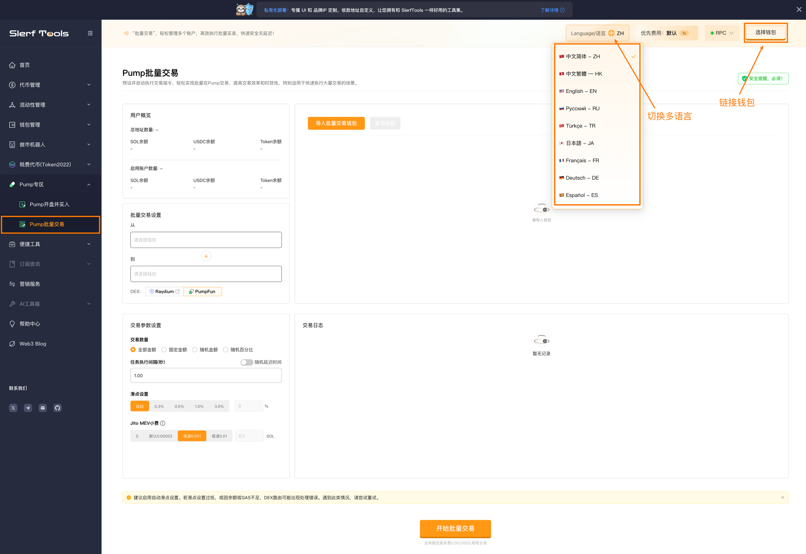
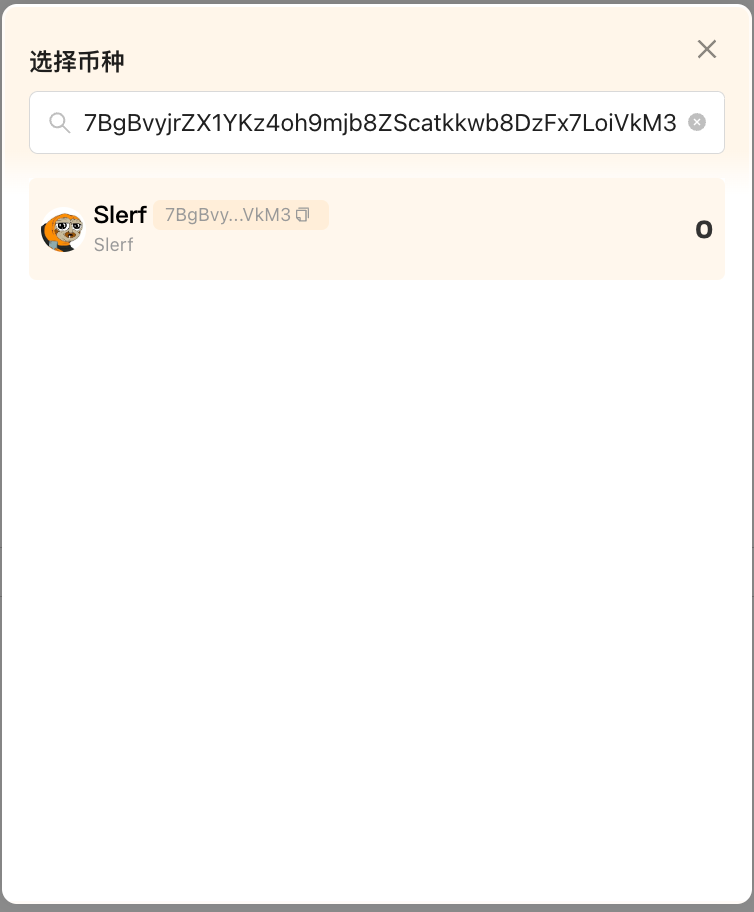
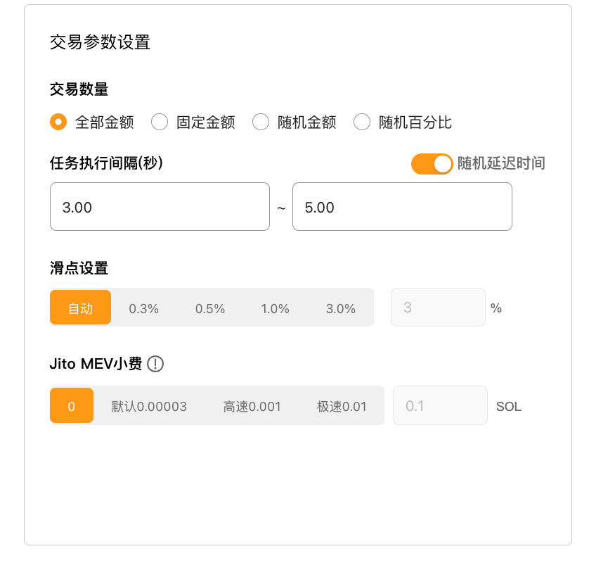
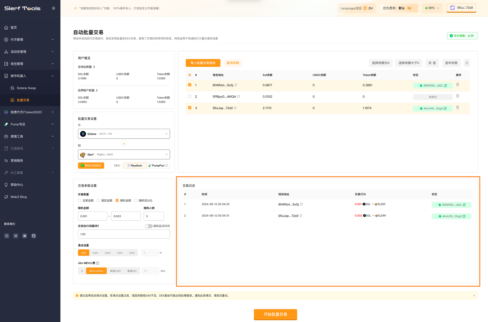

# Pump批量交易教程
Pump批量交易 | 高效多账户管理 | Jito小费 | 快速安全无延迟

使用Solana批量交易工具，轻松管理多个账户，高效执行批量交易，降低交易成本和时间，优化资金使用效率。

[立即体验>>>](https://slerf.tools/zh-cn/pump-volume-bot/solana)

Pump 批量交易的流程和Raydium 基本一样，只需要选择不同的 SWAP 即可

[Raydium批量交易](https://slerf.tools/zh-cn/multi-swap/solana)　　[Pump批量交易](https://slerf.tools/zh-cn/pump-volume-bot/solana)

>我们致力于为您提供一个安全可靠的平台，以确保您的隐私得到充分保护，同时不会对您的钱包造成任何伤害,我们的宗旨是**忠于用户**、**服务用户**。我们追求的是**与用户建立长久可靠的信任**。

### 如何使用 Pump 批量交易工具

1.链接钱包

2.选择要进行批量交易的币种

3.导入批量交易钱包，并查询余额

4.选择要进行交易的钱包

5.设置批量交易相关参数

.开始批量交易

### 准备事项：

1.一台电脑或者一部手机

2.Solana 钱包（幻影钱包Phantom安装教程）

3.要进行批量交易的钱包私钥

4.批量交易所需代币

5.一些 SOL 用于支付交易 GAS

### 具体步骤：

1.链接钱包

Pump 批量交易：https://slerf.tools/zh-cn/pump-volume-bot/solana

进入  Solana 批量交易页面，右上角支持切换语言。

2.选择要进行批量交易的币种

还没有交易的代币？试试 Pump [开盘并买入>>>](https://slerf.tools/zh-cn/pump-launch-and-buy-token/solana)

如果非当前钱包持有代币，可以通过代币合约进行搜索

3.导入批量交易钱包，并查询余额

4.选择要进行交易的钱包

5.设置批量交易相关参数

 交易数量设置（单位为支出的代币），可设置全部金额，固定金额，随机金额，随机百分比满足不同需求

 任务执行间隔（秒）：每个地址之间发起交易的时间，支持按照范围随机时间间隔

 滑点设置：如果需要快速交易的话，选择自动即可

 Jito EVM小费：Jito 小费可以简单理解为用户选择支付给矿工的“贿赂”费用，提高交易的优先级，费用越高，交易上链速度越快。

6.开始批量交易

可实时查看交易日志

温馨提示：

建议启用自动滑点设置，若滑点设置过低，或因余额或GAS不足，DEX路由可能出现处理错误。遇到此类情况，请尝试重试。

链上卡顿时，可能会导致交易失败概率较高，建议提高 Jito 小费金额，提升交易速度

使用便捷工具提升批量交易速度

批量转账　　批量归集

SlerfTools | 创建代币、批量空投和做市机器人等Solana工具集

安全、开源，给Solana用户带来最便利的一站式体验。

SlerfTools社群

Twitter：https://twitter.com/SlerfTools

Telegram：https://t.me/SlerfTools

Gitbook：https://docs.slerf.tools/

Github：https://github.com/slerfTools/slerfTools

Medium：https://slerftools.medium.com/

YouTube：https://www.youtube.com/@slerftools

邮箱：BD@slerf.tools

SlerfTools保留随时全权酌情因任何理由修改、变更或取消此公告的权利，无需事先通知。以上信息内容仅供参考，SlerfTools对本平台上的任何虚拟资产、产品或促销活动不做任何推荐或保证。虚拟资产的价格波动很大，投资交易虚拟资产将面临巨大风险。请谨慎投资。
