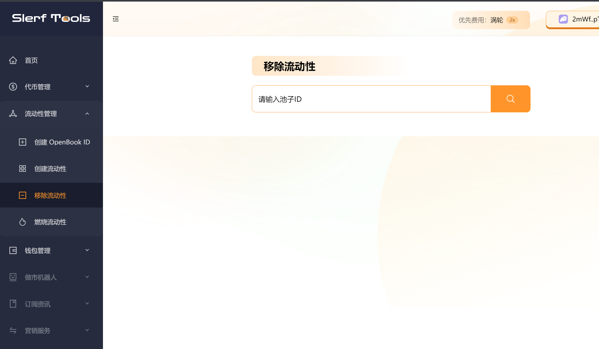
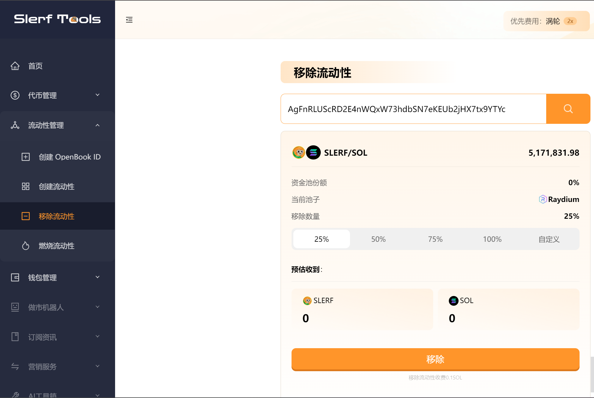

# 如何移除raydium池子
>我们致力于为您提供一个安全可靠的平台，以确保您的隐私得到充分保护，同时不会对您的钱包造成任何伤害,我们的宗旨是**忠于用户**、**服务用户**。我们追求的是**与用户建立长久可靠的信任**。

### 为什么要在raydium撤池子？
- 风险管理：撤回资产可以是为了管理风险。如果您认为市场或项目面临不确定性或风险增加，您可能希望减少在 Raydium 池子中的资产敞口，以保护您的投资。
- 资产重新配置：您可能希望重新配置您的资产分配。撤回资产可以为您提供资金，以便在其他池子、项目或投资中进行重新分配。这可以是根据您的投资策略或市场条件的变化而做出的决策。
- 提取收益：在参与流动性挖矿或其他提供流动性的活动时，您会获得奖励或回报。通过撤回资产，您可以提取您在 Raydium 池子中累积的收益或奖励，以实现利润。
- 参与其他活动：撤回资产可以为您提供资金参与其他活动或投资。您可以将资金用于交易、投资新项目、提供流动性到其他平台等。
- 退出 Raydium：撤回资产也可以意味着您决定退出 Raydium 平台或不再参与其提供的活动。这可能是因为您对该平台的兴趣减少、风险偏好发生变化或其他个人决策。

### 接下来我们来演示在solana链上撤池子的示例

[点此进入撤池子页面](https://slerf.tools/liquidity-remover/solana) 如下图所示

输入[池子id](https://slerf.tools/liquidity-creator/solana)，如果还没有[池子id](https://slerf.tools/liquidity-creator/solana) 可以[点击此处](https://slerf.tools/openbook-market/solana)先去创建openbookid  然后再[点击此处](https://slerf.tools/liquidity-creator/solana)去创建流动性(创建池子)

输入池子id后，点击查询，等待查询后显示池子信息。

点击移除即可完成移除流动性的操作