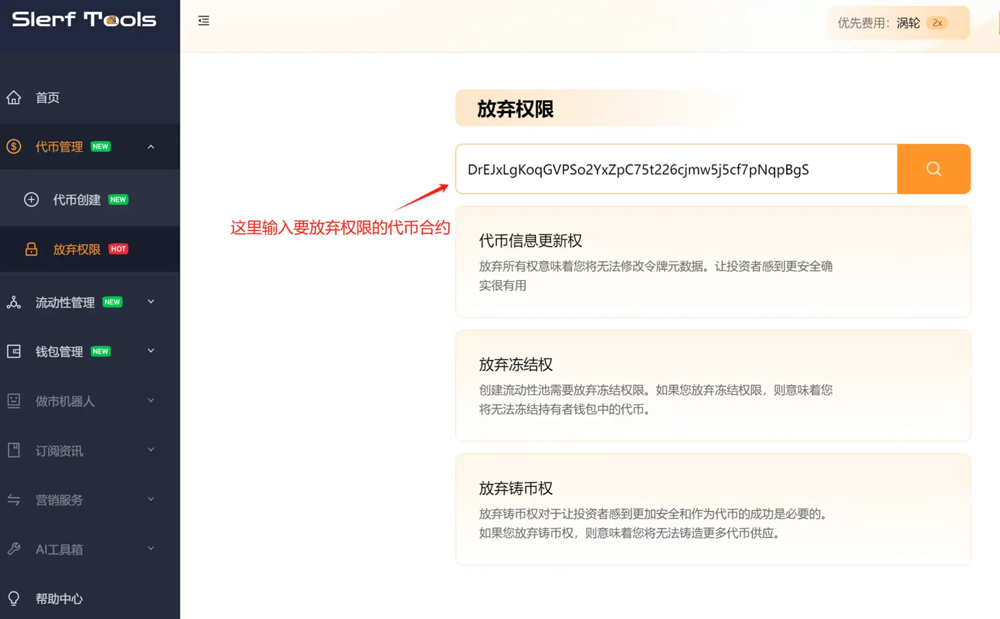
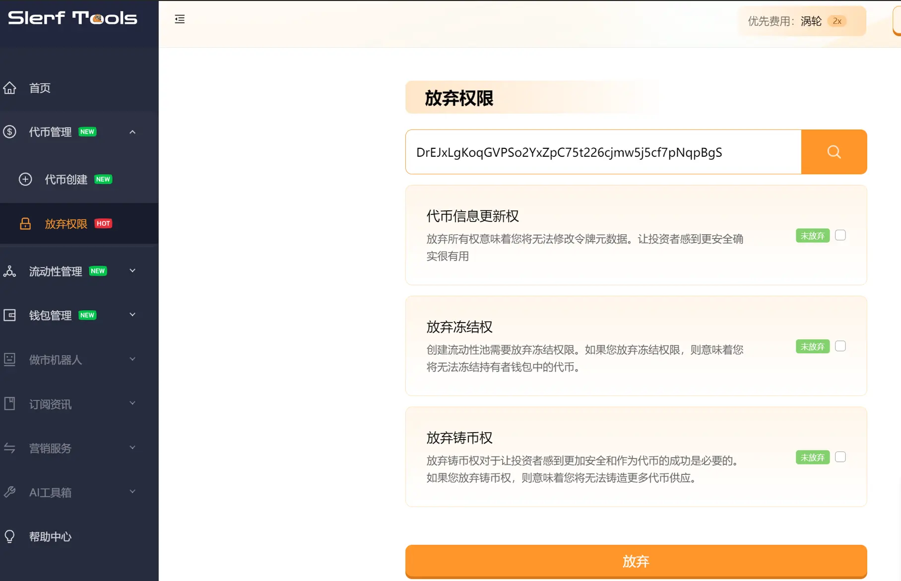
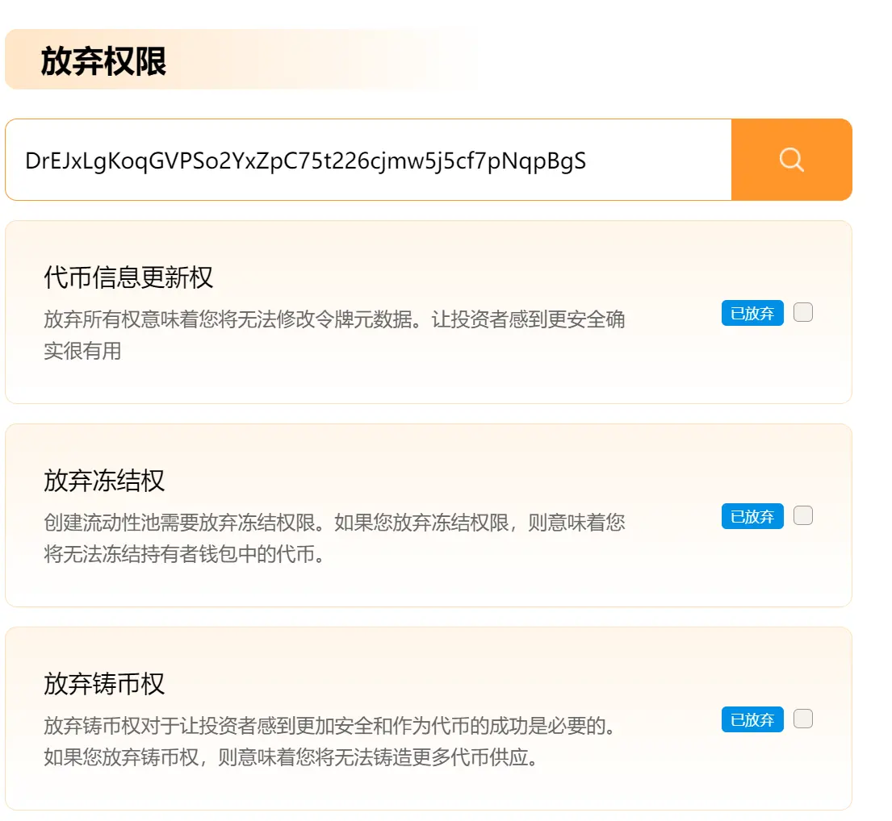

# solana链放弃代币权限
>我们致力于为您提供一个安全可靠的平台，以确保您的隐私得到充分保护，同时不会对您的钱包造成任何伤害,我们的宗旨是**忠于用户**、**服务用户**。我们追求的是**与用户建立长久可靠的信任**。
### 如何放弃代币权限
首先打开权限工具[放弃权限页面](https://slerf.tools/revoke-authority/solana)，然后输入代币合约地址,如下图

在放弃权限的输入框中输入刚刚创建代币的合约地址
代币地址： DrEJxLgKoqGVPSo2YxZpC75t226cjmw5j5cf7pNqpBgS

**这里填你自己创建的代币**的地址就行，如果还没有代币可以先点击此[链接](https://slerf.tools/token-creator/solana)去创建 

点击查询后，待权限校验完成，将出现以下画面

依次勾选放弃代币的信息更新权、冻结权、铸币权，然后点击放弃按钮

等待网站唤起钱包签名后，点击确认签名。

权限放弃成功后如下图。这时候你就已经完成代币权限的放弃了

