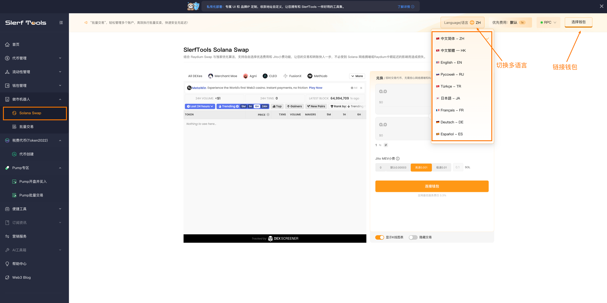
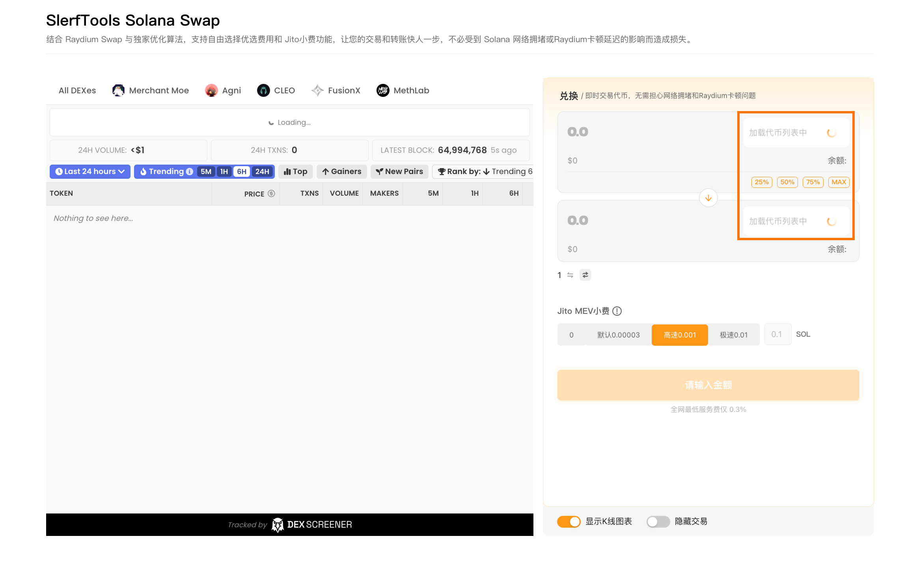
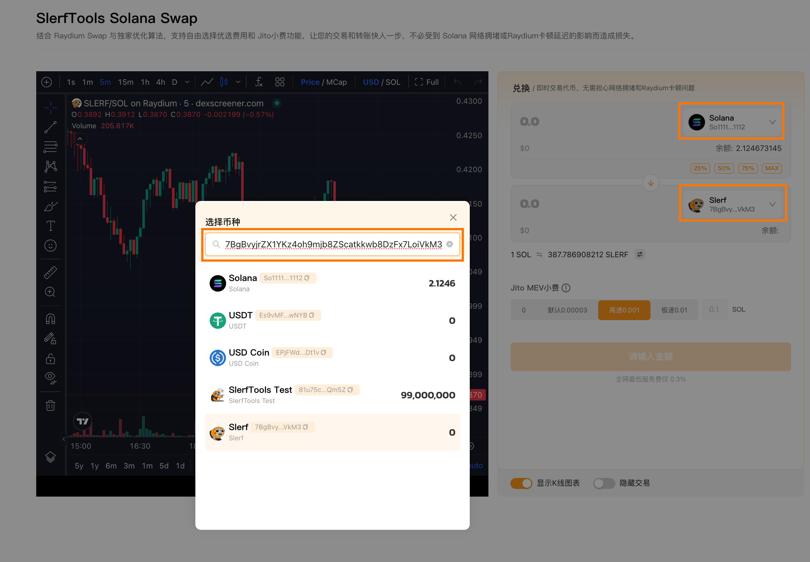
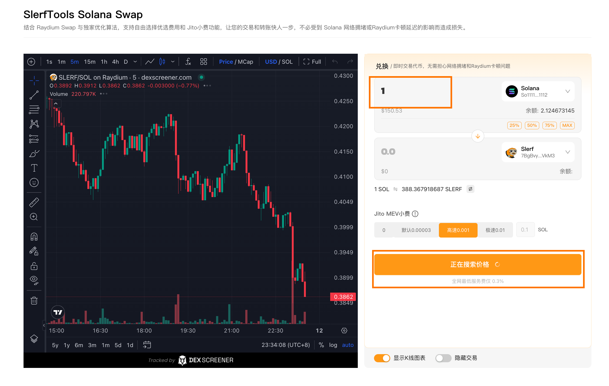
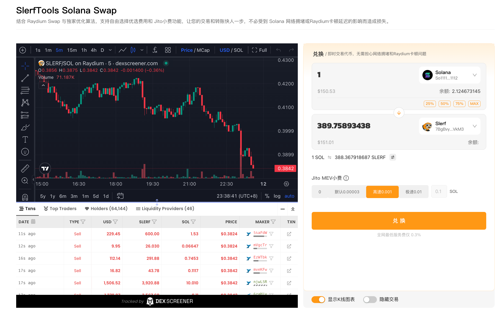
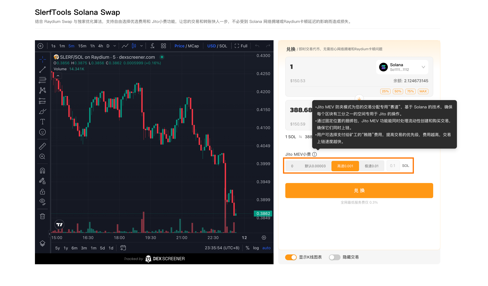

# Solana Swap使用教程

Solana交易 | 独家算法优化 | Jito 小费 | 快速安全无延迟
让您的交易和转账更快、更安全，避免Solana网络拥堵和Raydium延迟造成的损失。结合Raydium Swap与独家优化算法，支持优选费用和Jito小费，

[SlerfTools-Solana工具集](https://slerf.tools)

>我们致力于为您提供一个安全可靠的平台，以确保您的隐私得到充分保护，同时不会对您的钱包造成任何伤害,我们的宗旨是**忠于用户**、**服务用户**。我们追求的是**与用户建立长久可靠的信任**。

### 如何使用 Solana Swap工具
1.链接钱包

2.等待加载已有代币信息

3.选择要进行交易的代币

4.输入要交易的代币数量，获取最优价格

5.选择 Jito MEV小费

6.确认兑换发送上链等待交易完成

### 准备事项：
1.一台电脑或者一部手机

2.Solana 钱包（幻影钱包Phantom安装教程）

3.要进行交易的代币

4.一些 SOL 用于支付链上 GAS

### 具体步骤：
1.链接钱包

SlerfTools Solana Swap：https://slerf.tools/zh-cn/swap/solana

进入 SlerfTools Swap 页面，右上角支持切换语言。

2.等待加载已有代币信息

链接钱包后，会自动检索当前钱包持有的代币，用于快捷选择进行交易

3.选择或搜索要进行交易的代币

4.输入要交易的代币数量，获取最优价格

5.选择 Jito EVM 小费

Jito 小费可以简单理解为用户选择支付给矿工的“贿赂”费用，提高交易的优先级，费用越高，交易上链速度越快。

链上如果不拥堵，或者交易紧急性不高的话，可以选择 Jito 小费为 0 无需支付

6.确认兑换发送上链等待交易完成

SlerfTools | 创建代币、批量空投和做市机器人等Solana工具集

安全、开源，给Solana用户带来最便利的一站式体验。

SlerfTools社群

Twitter：https://twitter.com/SlerfTools

Telegram：https://t.me/SlerfTools

Gitbook：https://docs.slerf.tools/

Github：https://github.com/slerfTools/slerfTools

Medium：https://slerftools.medium.com/

YouTube：https://www.youtube.com/@slerftools

邮箱：BD@slerf.tools

SlerfTools保留随时全权酌情因任何理由修改、变更或取消此公告的权利，无需事先通知。以上信息内容仅供参考，SlerfTools对本平台上的任何虚拟资产、产品或促销活动不做任何推荐或保证。虚拟资产的价格波动很大，投资交易虚拟资产将面临巨大风险。请谨慎投资。

