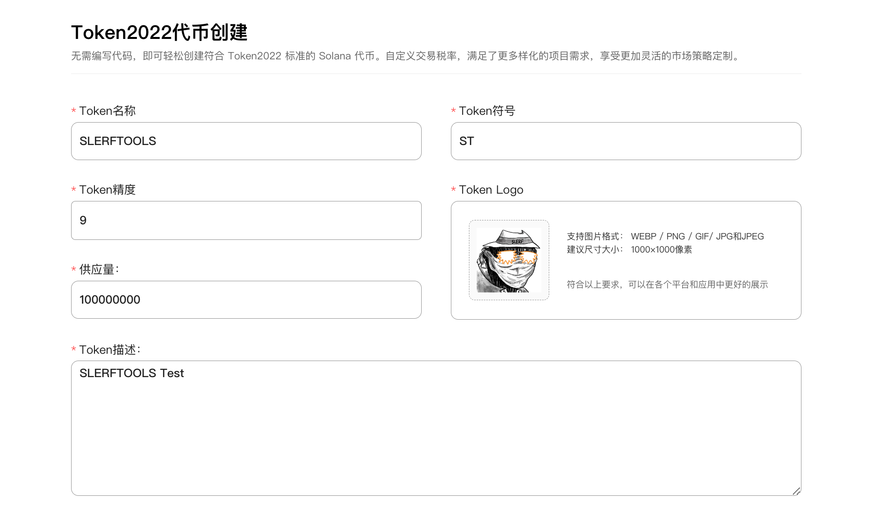

# Solana税费代币创建教程

创建Solana税费代币 | Token2022一键发币 | 快速简单且便宜

无需编写代码，即可轻松创建符合 Token2022 标准的 Solana 代币。自定义交易税率，满足更多样化的项目需求，享受更加灵活的市场策略定制。

[立即体验>>>](https://slerf.tools/zh-cn/tax-token-creator/solana)

如果您想创建普通 SPL 代币，[请点击>>>](https://slerf.tools/zh-cn/token-creator/solana)

[SlerfTools-Solana工具集](https://slerf.tools)

>我们致力于为您提供一个安全可靠的平台，以确保您的隐私得到充分保护，同时不会对您的钱包造成任何伤害,我们的宗旨是**忠于用户**、**服务用户**。我们追求的是**与用户建立长久可靠的信任**。

### 如何使用 Solana 税费(Token2022)代币创建工具
1.连接您的 Solana 钱包

2.输入您希望为项目代币设置的全称和简称

3.上传代币的Logo图片（建议尺寸 1000*1000 像素）

4.设置代币精度（小数位数）和总发行量

5.填写您希望为项目代币设置的描述

6.设置代币的交易或转账手续费率，以及单笔手续费用上限

7.设置代币的权限地址和手续费提现钱包地址（默认为当前钱包）

8.添加项目的社交链接（选填）

9.权限委托和计息利率等高级权限设置（选填）

10.代币元数据修改权限、冻结权限、铸币权限设置

11.创建代币，签名交易并等待代币创建完成

## 准备事项：
1.一台电脑或者一部手机

2.Solana 钱包（幻影钱包Phantom安装教程）

3.钱包最少准备 0.13 SOL

4.代币Logo和相关信息

## 具体步骤：
1. 链接Solana钱包
SlerfTools 目前支持多种流行的Solana钱包，例如Solflare、Phantom、ok钱包等。本文以Phantom钱包为例进行说明。

Solana 税费(Token2022)代币创建：https://slerf.tools/zh-cn/tax-token-creator/solana

进入 SlerfTools Token2022代币创建页面，右上角支持切换语言。

点击右上角的【选择钱包】按钮，在弹出窗口中选择你使用的钱包，钱包里面需要有 0.15 SOL用作支付：

连接后可以看到右上角显示的钱包地址

2. 填写代币相关信息并上传 Logo

3. 设置代币精度（小数位数）和总发行量

关于代币精度：代币精度定义了代币可以分割到多小的单位。 SPL代币的最大精度是9，常见的精度设置是6（实用代币）和9（高精度应用），0精度通常用于NFT。可参考以下数值设置

4.填写对于项目(代币)的描述，这是介绍您的项目最直观的地方

5.设置代币的相关机制参数

 费率%：每次交易或转账所需的手续费率，单位为百分比

 最高费用：单笔转账或交易时的最大手续费用上限

 权限钱包地址：默认为当前链接的钱包地址，控制此代币的所有权限

 提现钱包地址：代币所产生的手续费，有权限进行提现的地址，默认为当前链接的钱包地址

6.添加社项目的社交链接（选填）

如果您想让用户加入您的社群或者了解您的项目，那么这个信息是最直观的方式。

7.权限委托和计息利率等高级权限设置（选填）

>如果您不了解高级功能设置，请勿输入或修改(如果不想使用某个扩展，请将其输入留空)。

权限委托：将您的代币权限委托给另一个地址，该地址将能够燃烧或转移任意数量的代币。

计息利率%(0.00 - 100)：为您的代币设定利率，模仿债券等现实世界的资产，并随时获得利息。

默认账户状态：简化限制执行，默认冻结​​获得代币的帐户，用户必须与某些服务交互才能解冻其帐户并使用代币。默认正常，不可修改。

不可转账（灵魂绑定代币）：默认关闭，使代币不可转让给其他地址，通常适用于独特成就等类型项目。

8.代币元数据修改权限、冻结权限、铸币权限设置

元数据更改权：“放弃所有权”意味着您将无法修改令牌元数据。

冻结权：如果您放弃冻结权限，则意味着您将无法冻结持有者钱包中的代币。

铸币权：“放弃铸币权”对于让投资者感到更加安全和作为代币的成功是必要的。如果您放弃铸币权，则意味着您将无法铸造更多代币供应。

9.创建代币，签名交易并等待代币创建完成

点击创建代币后，会先生成代币相关信息的源数据文件（Metadata）

生成过程大概需要 10 秒钟，之后会调起钱包，进行签名即可上链创建代币

10.创建完成后，可在页面底部查看到所创建代币的合约地址进行复制

也可以打开钱包，在Phantom钱包中查看创建代币的相关信息

常见问题：
1、为什么钱包不显示 logo？
答：Phantom钱包有时候信息有延迟，需要耐心等待一段时间。可以在Solana浏览器上搜索代币信息进行查看。

2、什么情况下丢弃权限？
答：一般情况下，在需要在 Raydium 添加的代币需要放弃冻结和铸币权限，元数据修改权限可以自行选择，如果放弃元数据权限，那么代币名称和logo将不能更新。

3、上传logo需要收费吗？
答：不需要，本平台采用的是 IPFS 的存储方案，完全免费。

SlerfTools | 创建代币、批量空投和做市机器人等Solana工具集

安全、开源，给Solana用户带来最便利的一站式体验。

SlerfTools社群

Twitter：https://twitter.com/SlerfTools

Telegram：https://t.me/SlerfTools

Gitbook：https://docs.slerf.tools/

Github：https://github.com/slerfTools/slerfTools

Medium：https://slerftools.medium.com/

YouTube：https://www.youtube.com/@slerftools

邮箱：BD@slerf.tools

SlerfTools保留随时全权酌情因任何理由修改、变更或取消此公告的权利，无需事先通知。以上信息内容仅供参考，SlerfTools对本平台上的任何虚拟资产、产品或促销活动不做任何推荐或保证。虚拟资产的价格波动很大，投资交易虚拟资产将面临巨大风险。请谨慎投资。
