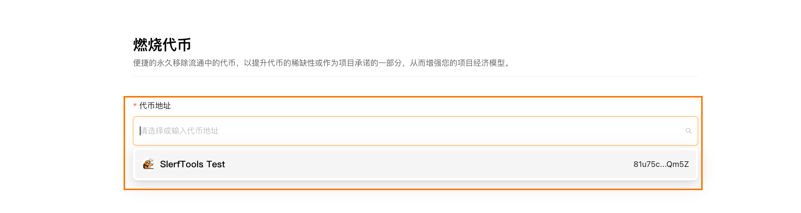
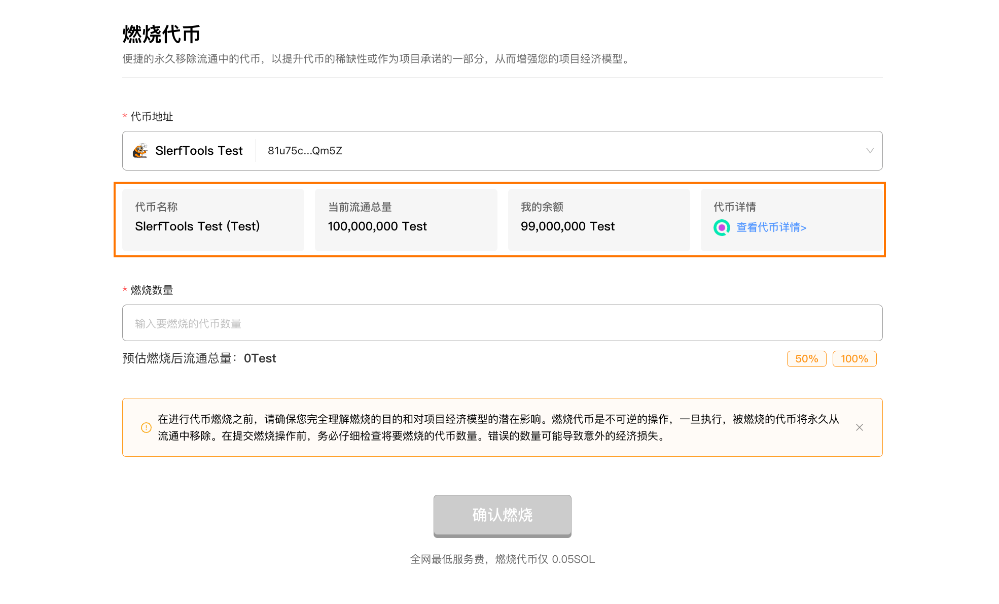
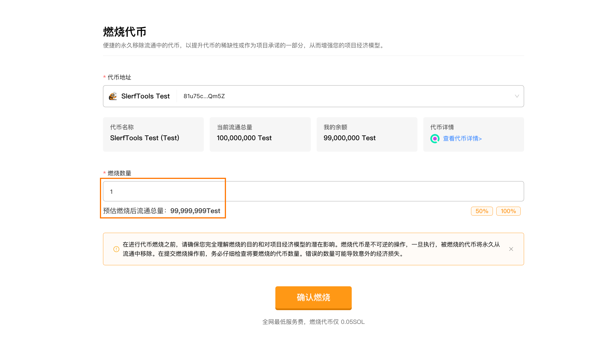
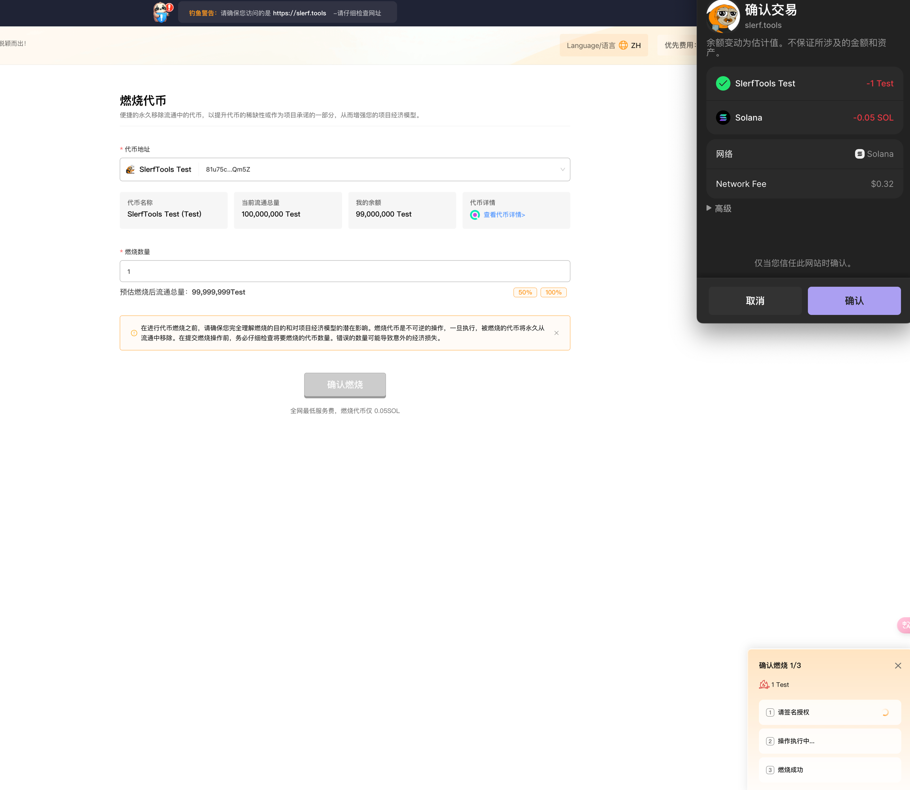

# Solana代币燃烧教程
>便捷的永久移除流通中的代币，以提升代币的稀缺性或作为项目承诺的一部分，从而增强您的项目经济模型。

[SlerfTools-Solana工具集](https://slerf.tools)

>我们致力于为您提供一个安全可靠的平台，以确保您的隐私得到充分保护，同时不会对您的钱包造成任何伤害,我们的宗旨是**忠于用户**、**服务用户**。我们追求的是**与用户建立长久可靠的信任**。

### 如何使用 Solana 代币燃烧工具：
1.链接钱包

2.选择要燃烧的代币

3.检索代币相关信息

4.输入想要燃烧的代币数量

5.提交上链完成代币燃烧

### 准备事项：
1.一台电脑或者一部手机

2.Solana 钱包（幻影钱包Phantom安装教程）

3.钱包最少准备 0.03 SOL

4.要冻结的代币合约和要冻结的账户地址信息

### 具体步骤：
1.链接钱包

SlerfTools 目前支持多种流行的Solana钱包，例如Solflare、Phantom、ok钱包等。本文以Phantom钱包为例进行说明。

[Solana代币燃烧](https://slerf.tools/zh-cn/token-burner/solana)

进入 SlerfTools 代币燃烧页面，右上角支持切换语言。

2.选择要燃烧的代币

3.检索代币相关信息

4.输入想要燃烧的代币数量
输入要燃烧的数量后，会显示预估燃烧后的流通总量以便核对。

5.提交上链完成代币燃烧

>在进行代币燃烧之前，请确保您完全理解燃烧的目的和对项目经济模型的潜在影响。燃烧代币是不可逆的操作，一旦执行，被燃烧的代币将永久从流通中移除。在提交燃烧操作前，务必仔细检查将要燃烧的代币数量。错误的数量可能导致意外的经济损失。

SlerfTools | 创建代币、批量空投和做市机器人等Solana工具集

安全、开源，给Solana用户带来最便利的一站式体验。
