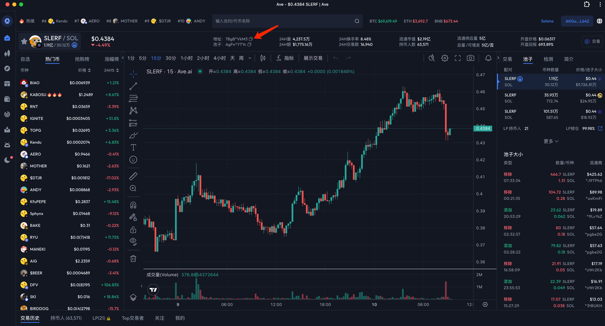
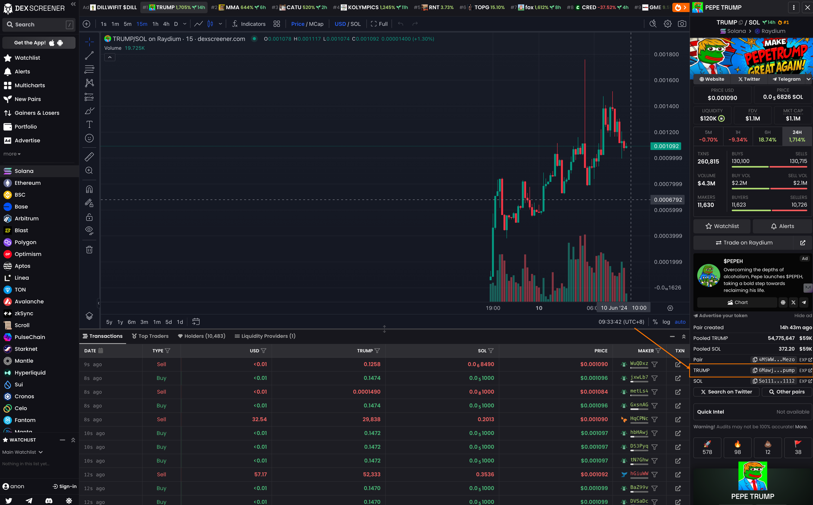
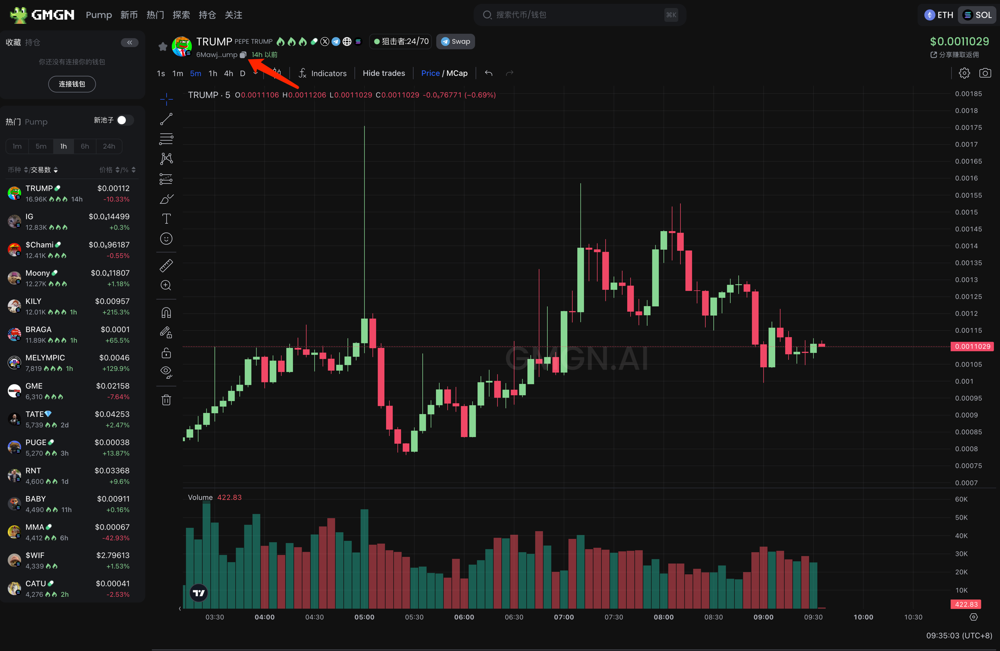
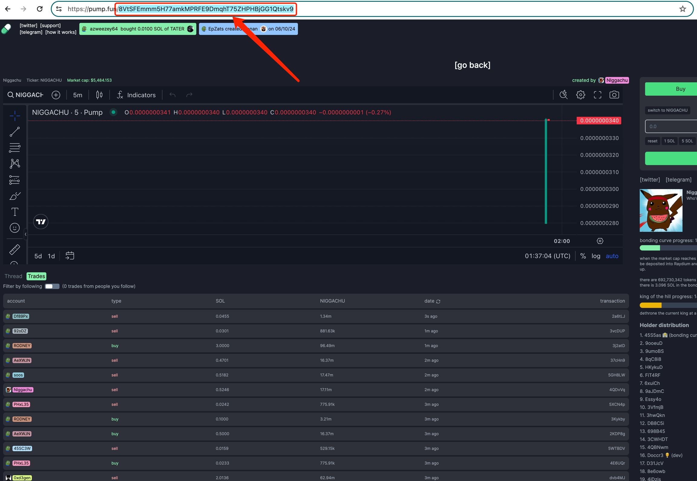
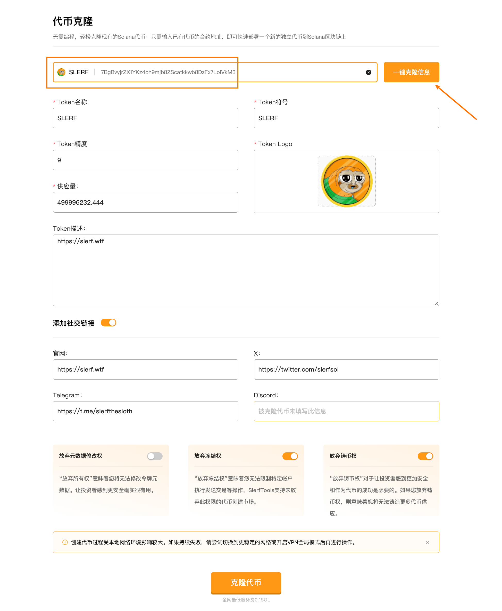
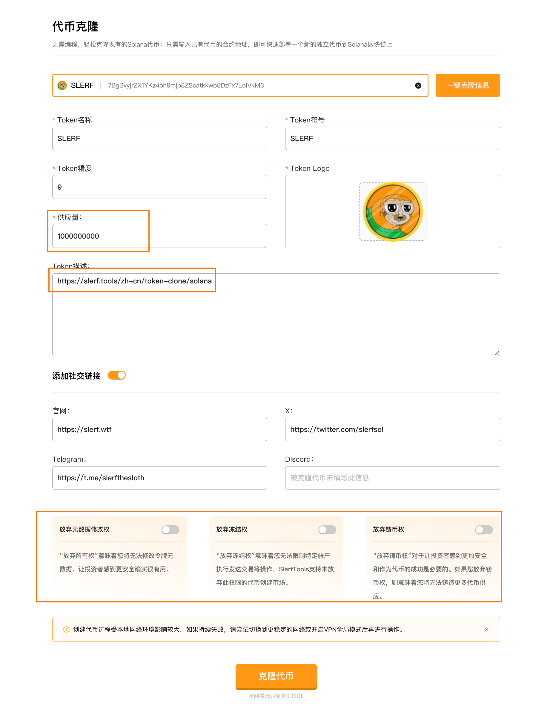
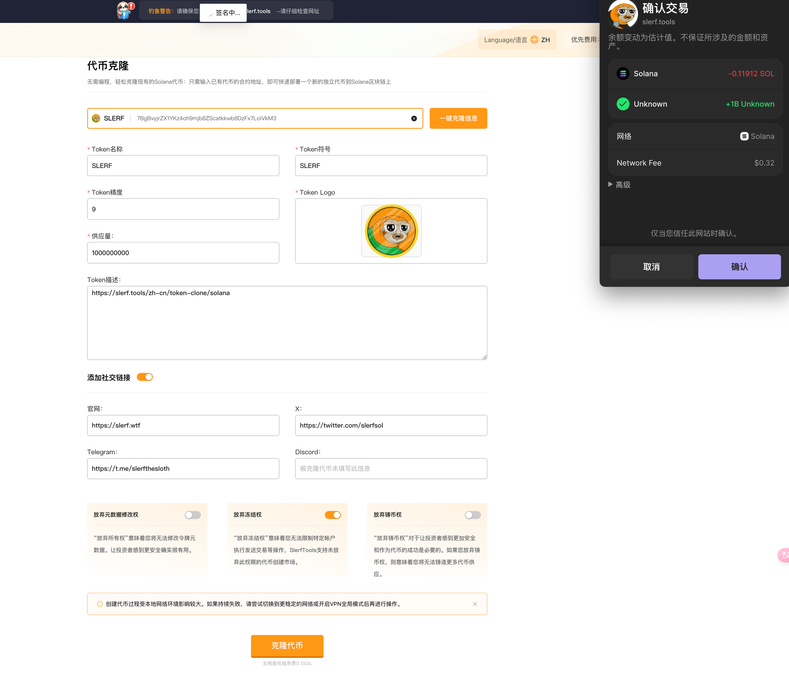

SlerfTools-Solana工具集

>我们致力于为您提供一个安全可靠的平台，以确保您的隐私得到充分保护，同时不会对您的钱包造成任何伤害,我们的宗旨是忠于用户、服务用户。我们追求的是与用户建立长久可靠的信任。

如何使用 Solana 代币克隆工具：

1.链接钱包

2.粘贴或输入要克隆的代币合约地址

3.检索克隆代币相关信息

4.复核代币相关信息和权限状态

5.提交上链完成代币克隆

### 准备事项：

1.一台电脑或者一部手机

2.Solana 钱包（幻影钱包Phantom安装教程）

3.钱包最少准备 0.15 SOL

4.要克隆的代币合约信息

### 具体步骤：

1.链接钱包

SlerfTools 目前支持多种流行的Solana钱包，例如Solflare、Phantom、ok钱包等。本文以Phantom钱包为例进行说明。

[Solana代币克隆](https://slerf.tools/zh-cn/token-clone/solana)

进入 SlerfTools 代币克隆页面，右上角支持切换语言。

2.粘贴或输入要克隆的代币合约地址
可以第三行行情平台或者链上查看代币合约信息

AVE（https://ave.ai/）：

Dexscreener（https://dexscreener.com/）：

GMGN（https://gmgn.ai/）

PUMP（https://pump.fun/）

3.检索克隆代币相关信息

4.支持已克隆信息和权限配置修改，自由度更高

5.提交签名上链，生成新的代币元数据和代币合约，完成克隆代币

创建代币过程受本地网络环境影响较大。如果持续失败，请尝试切换到更稳定的网络或开启VPN全局模式后再进行操作。

SlerfTools | 创建代币、批量空投和做市机器人等Solana工具集

安全、开源，给Solana用户带来最便利的一站式体验。
