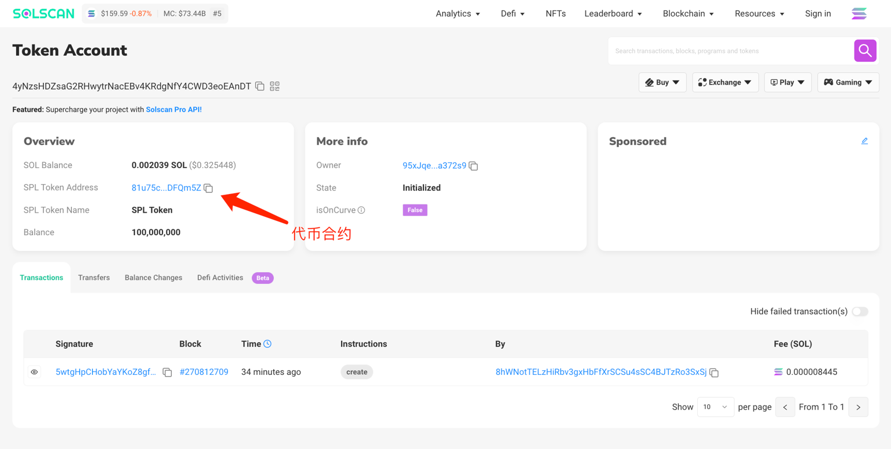
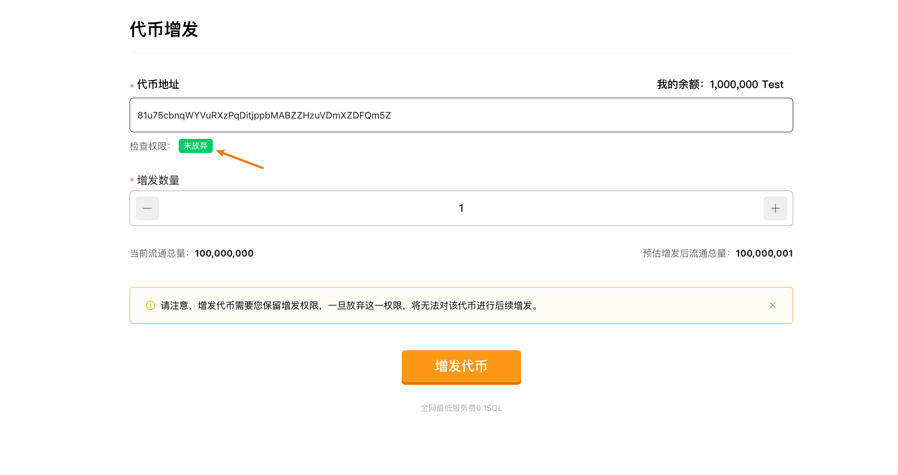

[SlerfTools-Solana工具集](https://slerf.tools)

>我们致力于为您提供一个安全可靠的平台，以确保您的隐私得到充分保护，同时不会对您的钱包造成任何伤害,我们的宗旨是**忠于用户**、**服务用户**。我们追求的是**与用户建立长久可靠的信任**。

### 如何使用 Solana 代币增发工具
1. 连接您的 Solana 钱包

2. 选择或输入要增发的代币合约

3. 查询代币增发权限

4. 填写想要增发的代币数量

5. 核对代币当前流通量和预估增发后流通总量

6. 签名交易并等待代币增发完成

### 准备事项：
1. 一台电脑或者一部手机

2. Solana 钱包（幻影钱包Phantom安装教程）

3. 钱包最少准备 0.1 SOL

4. 代币合约信息

### 具体步骤：
1. 链接钱包

SlerfTools 目前支持多种流行的Solana钱包，例如Solflare、Phantom、ok钱包等。本文以Phantom钱包为例进行说明。

[Solana代币增发](https://slerf.tools/zh-cn/token-mint/solana)

进入 SlerfTools 代币增发页面，右上角支持切换语言。

2. 选择要增发的代币

  1.可快捷选择当前链接钱包持有的代币

  2.复制要放弃权限的代币合约（可从钱包点击对应代币在浏览器查看合约地址）

  3.查询代币增发权限
如果代币增发权限已放弃，或者当前链接钱包没有所选代币的增发权限，会提示【已放弃】无法增发
如果当前链接钱包有所选代币的增发权限，同时代币未放弃增发权限，则可以增发，如下图所示：

  4.填写想要增发的代币数量，并核对数据

确认增发后签名交易并等待代币增发完成

>请注意，增发代币需要您保留增发权限，一旦放弃这一权限，将无法对该代币进行后续增发。

SlerfTools | 创建代币、批量空投和做市机器人等Solana工具集

安全、开源，给Solana用户带来最便利的一站式体验。
