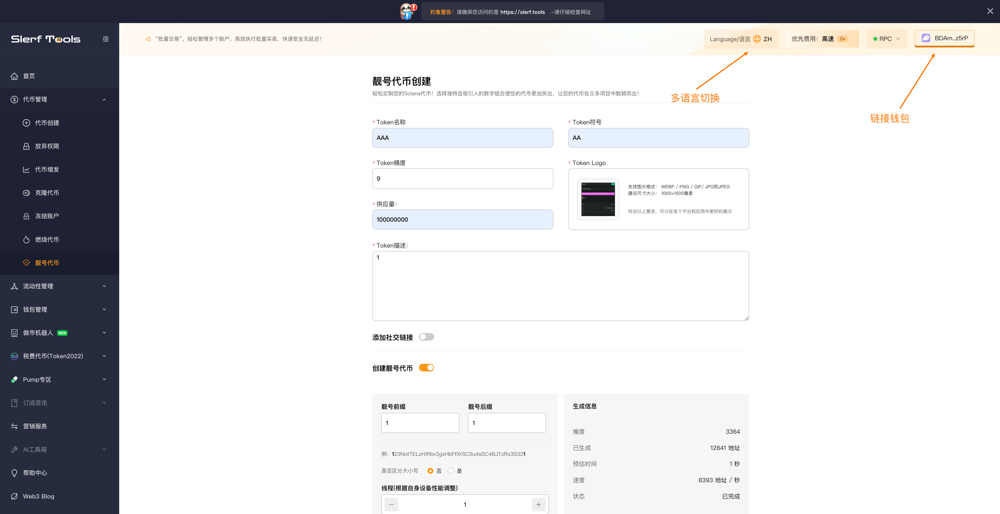
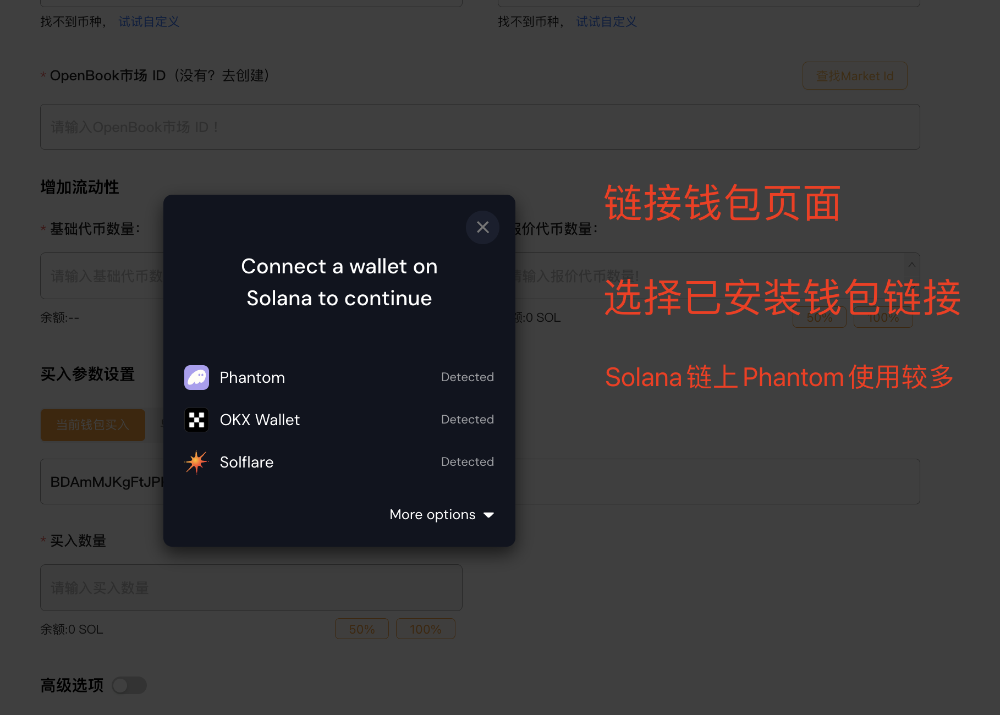
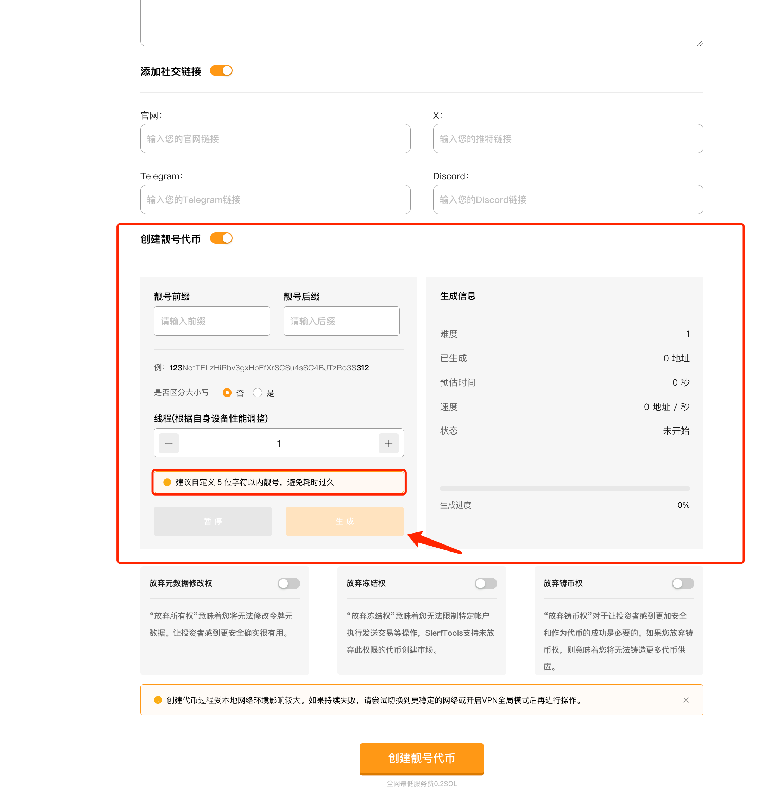
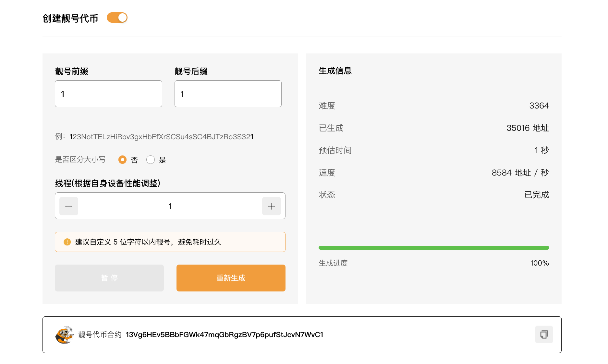
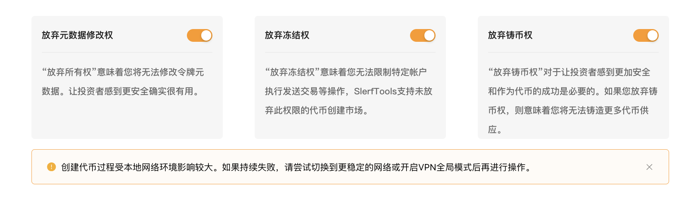
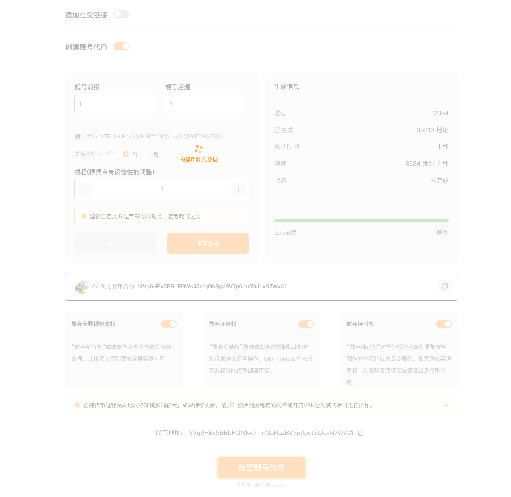

# Solana靓号代币创建教程
快速生成含有特定数字或字母组合的Solana钱包地址，提供个性化和易记的选项，增添您的数字身份的独特魅力。

[SlerfTools-Solana工具集](https://slerf.tools)

>我们致力于为您提供一个安全可靠的平台，以确保您的隐私得到充分保护，同时不会对您的钱包造成任何伤害,我们的宗旨是**忠于用户**、**服务用户**。我们追求的是**与用户建立长久可靠的信任**。
### 如何使用 Solana 靓号代币创建工具
1.连接您的 Solana 钱包

2.输入您希望为代币设置的名称(项目全称)

3.填写代币符号（最多10个字符）

4.设置代币精度（小数位数）

5.填写您希望为 SPL 代币设置的描述

6.上传代币的Logo图片

7.设置代币的总发行量

8.添加代币描述和社交链接（选填）

9.设置自定义前缀和后缀，生成指定靓号合约地址

10.创建靓号代币，签名交易并等待靓号代币创建完成

### 准备事项：
1.一台电脑或者一部手机

2.Solana 钱包（幻影钱包Phantom安装教程）

3.钱包最少准备 0.25 SOL

4.代币Logo和相关信息

###  具体步骤：
1.链接钱包

SlerfTools 目前支持多种流行的Solana钱包，例如Solflare、Phantom、ok钱包等。本文以Phantom钱包为例进行说明。

[创建Solana靓号代币](https://slerf.tools/zh-cn/token-vanity-creator/solana)

进入 SlerfTools 创建靓号代币页面，右上角支持切换语言。

2.填写代币相关信息

3.自定义靓号代币合约前缀和后缀，并生成靓号代币合约

生成靓号代币的过程由本地算力计算，不同设备所需时间可能不同，需要耐心等待

生成靓号合约完成后，会显示已生成的靓号代币合约，如下图所示

4.设置代币相关权限

  1.元数据修改权：“放弃元数据修改权”意味着您将无法修改令牌元数据，比如代币名称和 Logo 等信息。

  2.冻结权：“放弃冻结权”意味着您无法限制特定帐户执行发送交易等操作，SlerfTools支持未放弃此权限的代币创建市场。

  3.铸币权：“放弃铸币权”对于让投资者感到更加安全和作为代币的成功是必要的。如果您放弃铸币权，则意味着您将无法铸造更多代币供应。

5.确认【创建靓号代币】，链上执行

点击创建代币后，会先生成代币相关信息的源数据文件（Metadata）

生成过程大概需要 10 秒钟，之后会调起钱包，进行签名即可上链创建代币

6. 创建完成后，可在页面底部查看到所创建代币的合约地址进行复制

也可以打开钱包，在Phantom钱包中查看创建代币的相关信息

## 常见问题：
1.代币符号是什么？
代币符号是代币的简短标识，通常由几个大写字母组成，例如 SOL 或 USDC。

2.代币精度是什么，怎么填写？
代币精度定义了代币可以分割到多小的单位。SPL代币的最大精度是9，常见的精度设置是6（实用代币）和9（高精度应用），0精度通常用于NFT。

3.代币供应量如何设定？
代币供应量应该基于代币的预定用途和市场策略来设定。注意，SPL代币的总供应量与精度挂钩，受到数据类型的限制（uint64），最大不超过18,446,744,073,709,551,615。

4.代币图像支持哪些格式和尺寸大小？
代币图像支持PNG、JPG和GIF格式，建议尺寸为256x256像素，以确保在不同平台上均能良好展示。

5.如何填写代币描述？
代币描述应简洁明了，概述代币的功能、目的和潜在价值。支持基本的文本格式化和链接，可以包括对项目的简要说明或指向项目网站的链接。

6.为什么要放弃元数据修改权？
放弃元数据修改权意味着一旦设置，代币的基本属性（如名称、符号、图像等）将无法更改。这通常用于增强项目的透明度和信任，显示项目方对代币和其未来计划的承诺。

7.什么是放弃冻结权？
放弃冻结权表明创建者无法随意冻结或解冻代币，增强了代币网络的去中心化特性和用户对代币的信任。

8.什么是放弃铸币权？
放弃铸币权意味着一旦代币发行完成，将无法增发新的代币。这通常用于限制供应量，防止通货膨胀，确保代币的稀缺性和价值。

9.如何保证我创建的代币的安全？
slerf.tools 提供的代币创建工具遵循 Solana 网络的标准安全实践。确保您的私钥安全，避免共享给不可信的第三方，是保护您代币安全的关键。

10.我可以定制我的代币参数吗？
是的，在 slerf.tools 上创建代币时，您可以自定义多个参数，包括代币名称、符号、总供应量以及是否可燃烧、可铸造或可冻结等特性。

11.在 slerf.tools 上创建代币需要多长时间？
创建过程本身通常很快，只需要几分钟。一旦您提交了所有必需的信息并支付了相关费用，代币几乎可以立即在 Solana 网络上生效。

12.创建 Solana 代币的成本是多少？
在 SlerfTools 上创建 Solana 代币的成本为 0.12 SOL，这包括了放弃权限的费用。这个费用涵盖了代币创建、初始化以及撤销冻结和铸币权限的操作。这样的设置帮助确保了代币的透明性和安全性，使得代币更受社区的信任。

13.我在 slerf.tools 创建的代币可以用于什么？
您创建的代币可以用于多种用途，包括但不限于：交易、投资、社区奖励、项目融资、游戏内货币或任何其他需要使用数字资产的场合。

14.可以增发 Solana SPL 代币吗？
可以，但需要您在创建代币时保留增发权限。如果您选择放弃这一权限，那么将无法对该代币进行后续增发。

15.Solana上发币需要合约开源吗？
答：不需要，Solana上的代币是通过官方发布好的合约创建出来的账户，所有的SPL20代币都用的是同一的合约。

16.为什么钱包不显示 logo？
答：Phantom钱包有时候信息有延迟，需要耐心等待一段时间。可以在Solana浏览器上搜索代币信息进行查看。

17.什么情况下丢弃权限？
答：一般情况下，在需要在 Raydium 添加的代币需要放弃冻结和铸币权限，元数据修改权限可以自行选择，如果放弃元数据权限，那么代币名称和logo将不能更新。

18.上传logo需要收费吗？
答：不需要，本平台采用的是 IPFS 的存储方案，完全免费。

SlerfTools | 创建代币、批量空投和做市机器人等Solana工具集

安全、开源，给Solana用户带来最便利的一站式体验。

