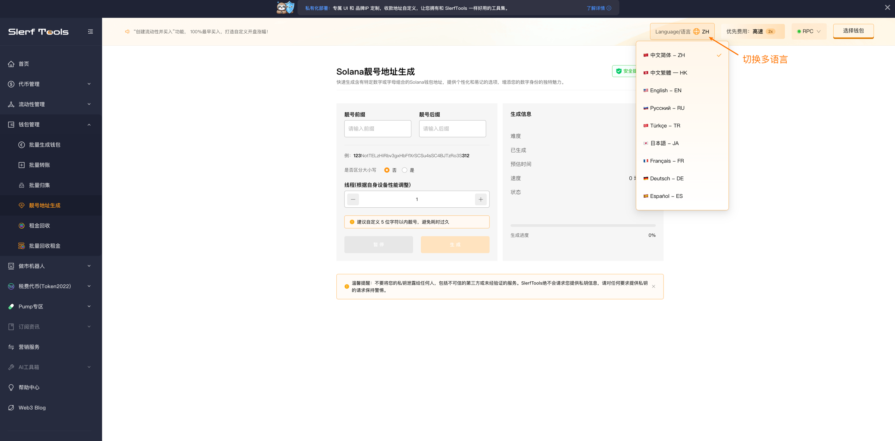
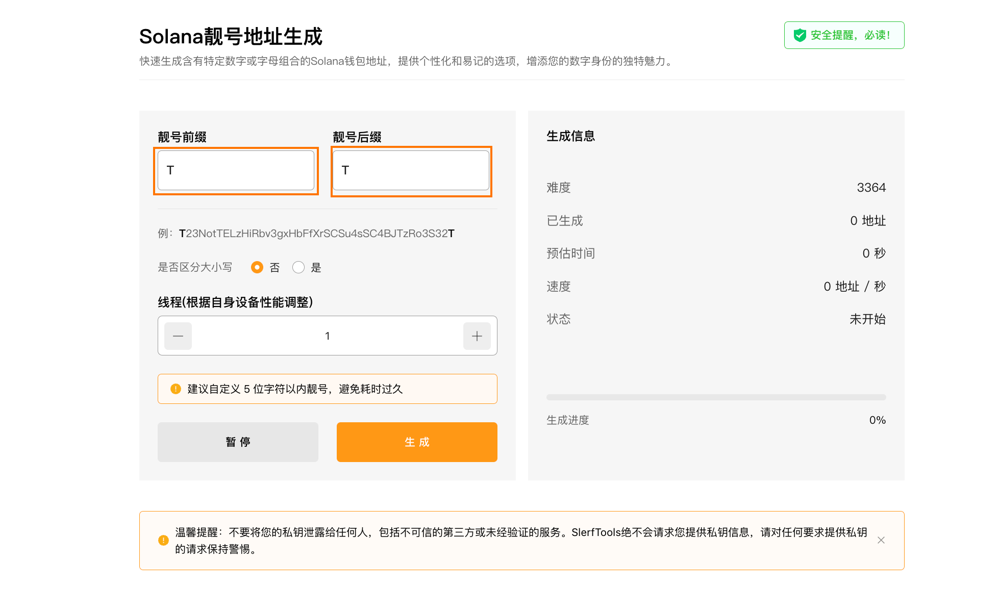
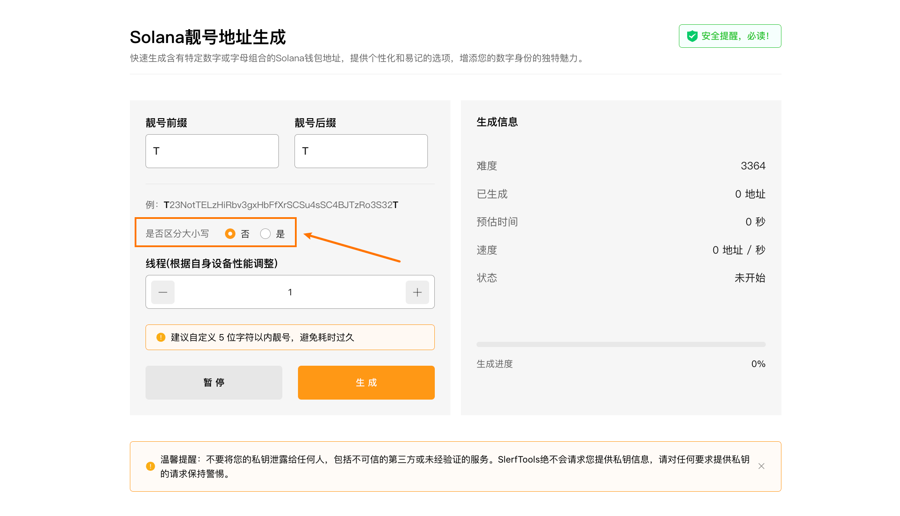
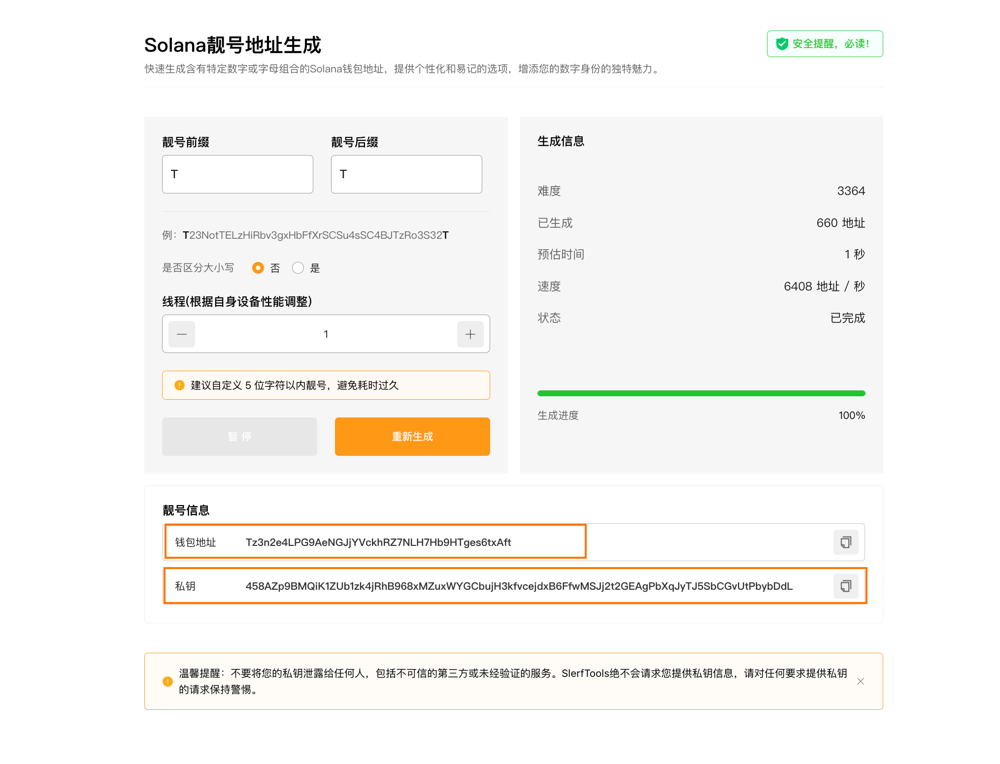

# Solana靓号钱包生成教程
快速生成含有特定数字或字母组合的Solana钱包地址，提供个性化和易记的选项，增添您的数字身份的独特魅力

[SlerfTools-Solana工具集](https://slerf.tools)

>我们致力于为您提供一个安全可靠的平台，以确保您的隐私得到充分保护，同时不会对您的钱包造成任何伤害,我们的宗旨是**忠于用户**、**服务用户**。我们追求的是**与用户建立长久可靠的信任**。

### 如何使用 Solana 靓号钱包生成工具
1.打开 SlerfTools 靓号地址生成页面

2.输入您想要自定义的靓号前缀和后缀

3.选择靓号地址是否区分大小写

4.开始生成靓号，等待输出靓号信息

5.保存已生成的私钥，导入其他钱包

生成钱包完全在本地电脑执行，建议在生成钱包时断开网络(禁用WIFI或拔掉网线)

## 准备事项：
1.一台电脑或者一部手机

2.Solana 钱包（幻影钱包Phantom安装教程）

## 具体步骤：
1. 打开 SlerfTools 靓号地址生成页面

Solana靓号地址生成：https://slerf.tools/zh-cn/token-vanity-creator/solana

进入 SlerfTools 创建靓号代币页面，右上角支持切换语言。

2.输入您想要自定义的靓号前缀和后缀

>建议自定义 5 位字符以内靓号，避免耗时过久

3.选择靓号地址是否区分大小写（不区分大小写生成速度会更快）

4.开始生成靓号，等待输出靓号信息，保存私钥。

>安全提醒：

生成钱包在用户本地电脑执行，网站不能、也永远不会存储你的私钥，建议在生成钱包时断开网络(禁用WIFI或拔掉网线)。

采用最新256位32字节随机种子进行随机生成私钥, 并通过keccak-256生成公钥根据用户设置匹配对应格式地址。无需担心被破解！

SlerfTools | 创建代币、批量空投和做市机器人等Solana工具集

安全、开源，给Solana用户带来最便利的一站式体验。
