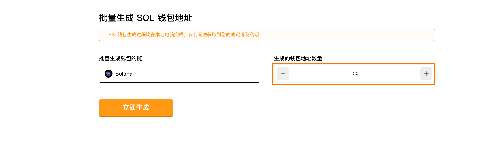
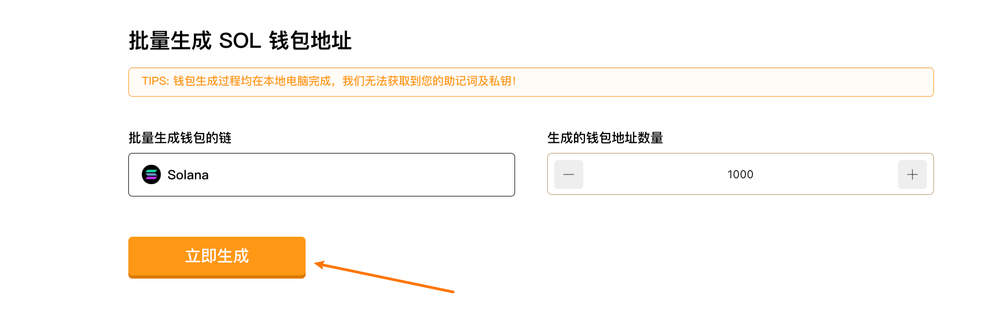
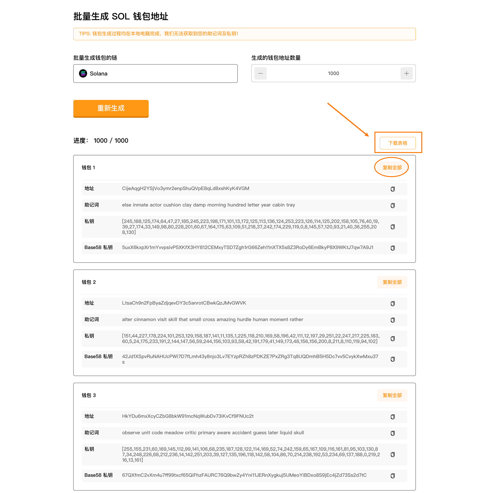

# Solana批量生成钱包教程
Solana批量生成钱包 | 生成指定数量的地址 | 安全免费

[SlerfTools-Solana工具集](https://slerf.tools)

>我们致力于为您提供一个安全可靠的平台，以确保您的隐私得到充分保护，同时不会对您的钱包造成任何伤害,我们的宗旨是**忠于用户**、**服务用户**。我们追求的是**与用户建立长久可靠的信任**。

### 如何使用 Solana 批量生成钱包工具
1.打开 SlerfTools 批量生成 SOL 钱包页面

2.设置要生成的钱包地址数量

3.点击立即生成，等待本地运行完成

4.复制已生成的钱包信息，或者下载表格

5.保存已生成的钱包信息，导入其他钱包

生成钱包完全在本地电脑执行，建议在生成钱包时断开网络(禁用WIFI或拔掉网线)

### 准备事项：
1.一台电脑或者一部手机

2.Solana 钱包（幻影钱包Phantom安装教程）

### 具体步骤：
1. 打开 SlerfTools 批量生成钱包页面

[批量生成 SOL 钱包](https://slerf.tools/zh-cn/wallet-creator/solana)

进入 SlerfTools 批量生成 SOL 钱包地址页面，右上角支持切换语言。

2.设置要生成的钱包地址数量

3.点击立即生成，等待本地运行完成

4.复制已生成的钱包信息，或者下载表格

生成的地址信息包括【助记词】、【私钥】和【Base58私钥】类型，兼容多种格式。

地址较多的情况下，建议下载表格方便管理

> 安全提醒：

生成钱包在用户本地电脑执行，网站不能、也永远不会存储你的私钥，建议在生成钱包时断开网络(禁用WIFI或拔掉网线)。

采用最新256位32字节随机种子进行随机生成私钥, 并通过keccak-256生成公钥根据用户设置匹配对应格式地址。无需担心被破解！

SlerfTools | 创建代币、批量空投和做市机器人等Solana工具集

安全、开源，给Solana用户带来最便利的一站式体验。
