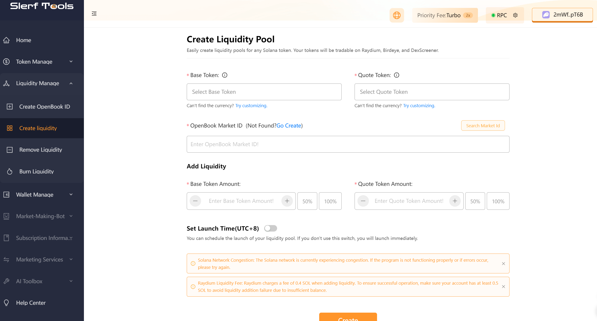
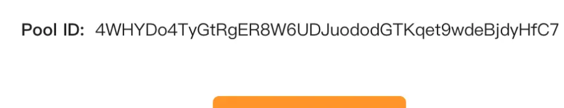

# How to add liquidity to Raydium on the Solana chain

> We are committed to providing you with a secure and reliable platform that ensures your privacy is fully protected without causing any harm to your wallet. Our mission is to be loyal to users and serve them. We aim to establish a long-term and trustworthy relationship with our users.

### What is Raydium and why should you add liquidity to Raydium?
Raydium is a decentralized trading platform on the Solana blockchain. The "adding liquidity" feature on Raydium allows users to pair different assets and provide liquidity for trading, market-making, and mining on Raydium.

The main purposes of adding liquidity are as follows:

- Provide liquidity: By pairing different assets and adding them to the liquidity pool, users contribute liquidity to the trading platform. This enables other users to trade on Raydium with lower slippage and higher execution efficiency.

- Trading: By adding liquidity, users can directly trade assets on Raydium. Without the need for an intermediary token, users can quickly and securely exchange and swap assets.

- Market-making: Liquidity providers can earn rewards through market-making mining. When other users trade on Raydium, liquidity providers receive a proportionate share of transaction fees based on their provided liquidity.

- Mining: Raydium also offers various liquidity mining pools where users can deposit assets and receive additional token rewards as incentives.

### Let's take a look at the steps to add liquidity to the pool:

- 1. [Create a liquidity page]((https://slerf.tools/liquidity-creator/solana) as shown in the following image:

After filling in the token contract, quote token (usually defaulting to SOL), [openbookid](https://slerf.tools/openbook-market/solana), as well as the quantity of tokens to be added and the quantity of quote tokens, click on [the create button](https://slerf.tools/token-creator/solana) .

If you don't have tokens yet, you can click [here ](https://slerf.tools/token-creator/solana)to create tokens first:

If you don't have an openbook ID, you can click[ here](https://slerf.tools/openbook-market/solana) to create one:

After waiting for the page to prompt for wallet connection, click on confirm to sign. The pool ID will be displayed.

You can keep this pool ID safe because you will need it if you want to withdraw from the pool later. In case you forget it, you can also find the pool ID on other websites such as ave.io.