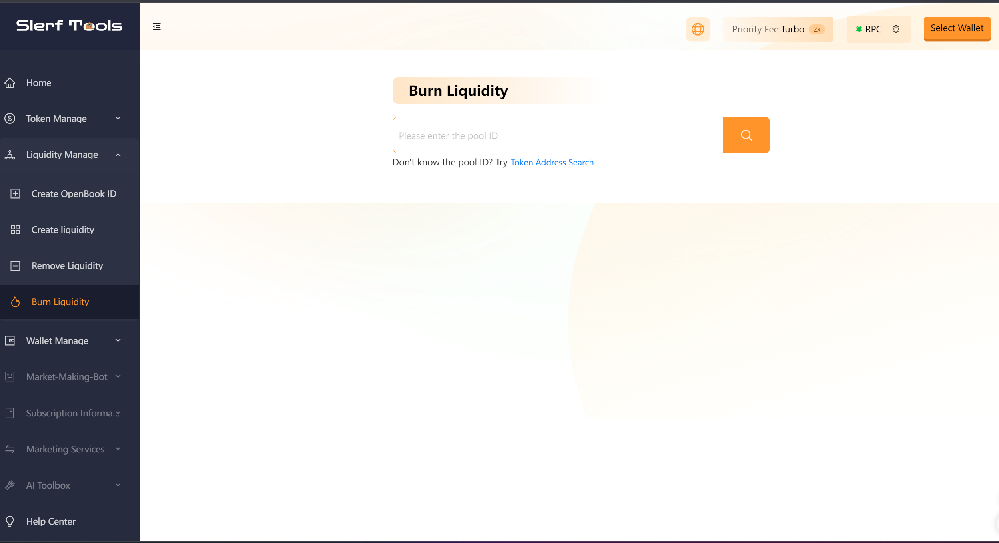
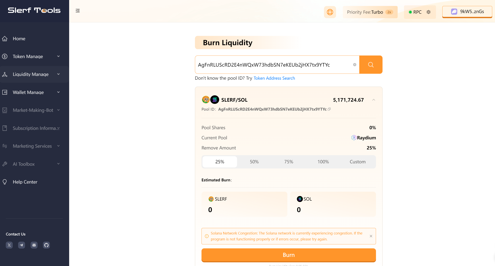

# How to burn a Raydium pool on the Solana blockchain.

> We are committed to providing you with a secure and reliable platform that ensures your privacy is fully protected without causing any harm to your wallet. Our mission is to be loyal to users and serve them. We aim to establish a long-term and trustworthy relationship with our users.

### Why do we burn Raydium pools?

In Raydium, burning pools refer to special pools used for token destruction or burning. The main purpose of burning pools is to reduce the total token supply through token destruction, thus achieving a deflationary effect. The significance and benefits of burning pools are as follows:

- Deflationary mechanism: By burning tokens, burning pools can decrease the token supply. Deflation helps increase the scarcity of the token, potentially increasing its value. This can bring potential value appreciation and investment returns for holders.

- Market demand: Burning pools can meet the market demand for deflationary tokens. Many investors and traders seek tokens with deflationary mechanisms as it is often seen as a way to hedge against inflation and increase long-term value.

- Market incentives: Burning pools are often combined with liquidity mining or other reward mechanisms. By depositing tokens into burning pools for mining, users can earn additional rewards. This incentive mechanism can attract more users to participate in token holding and engagement.

- Market regulation: Burning pools can be used to regulate the supply and demand of tokens. Based on market conditions and the project's economic model, teams can decide when to start or stop burning pools to balance supply and demand and adjust the token's circulation.

### Next, let's demonstrate an example of burning a pool.
Click [here](https://slerf.tools/lp/burn) to access the burning liquidity page, as shown in the following image.

Enter the Pool ID. If there is no existing pool, click [here](https://slerf.tools/lp/add) to create a pool:

Clicking on "Query" will display detailed information about the pool, as shown in the following image:

Then select the quantity to remove and click on "Burn" to complete the process.

## Question and Answer:
### How can I obtain the Pool ID?
- There are several ways to obtain the Pool ID:
- 1. After successfully creating liquidity on Raydium, the AMM ID will be displayed on the page, which corresponds to the Pool ID.

- 2. On the website https://rugcheck.xyz/, input your token address, and the address corresponding to the Raydium label in the address bar is the Pool ID.

- 3.  On the website https://avedex.cc/, input your token address, and the address following the pool is the Pool ID.

- 4. On the Solana blockchain explorer https://solscan.io/, find the transaction for creating liquidity that you performed. The Pool ID can be found there.

