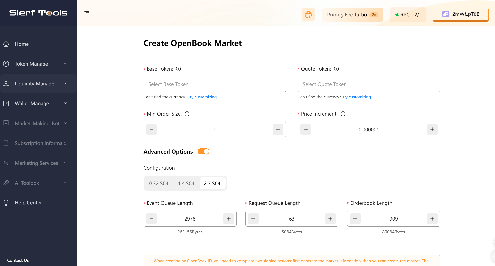
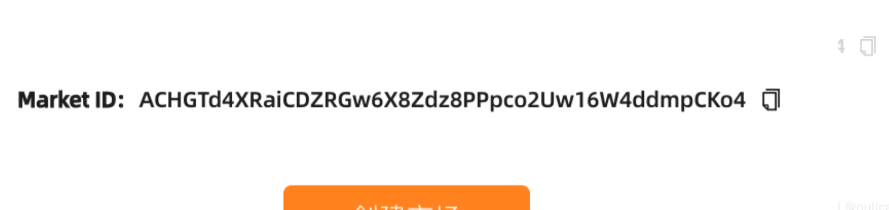

# Creating an OpenBook ID on the Solana Chain

> We are committed to providing you with a secure and reliable platform that ensures your privacy is fully protected without causing any harm to your wallet. Our mission is to be loyal to users and serve them. We aim to establish a long-term and trustworthy relationship with our users.

### Why do you need to create an OpenBook ID?
Raydium is a decentralized exchange platform on the Solana blockchain, and the OpenBook Market ID refers to the OpenBook market identifier required when creating a Raydium liquidity pool. OpenBook is a sub-project of Raydium that allows users to create custom Automated Market Makers (AMMs) and provide liquidity. When creating a liquidity pool on Raydium, you need to specify the OpenBook Market ID to determine the assets and market to pair with. This Market ID is a unique identifier for the OpenBook pool, and it will be associated with the liquidity pool you create to ensure accurate liquidity pairing and trading. Therefore, when creating a Raydium liquidity pool, you need to provide the OpenBook Market ID to properly set up and connect to the corresponding OpenBook market.

### To create an OpenBook ID:

Open the tool [webpage](https://slerf.tools/lp/openbook).
Fill in the required information for the token you want to create. If you haven't created a token yet, you can click on [this link](https://slerf.tools/token/create) to create one.

Please follow these steps:

Fill in the necessary parameters such as the base token, quote token, and minimum order quantity.
Click on the "Create Market" button.
After your wallet confirms the transaction, please wait for a moment for the transaction to be confirmed on the blockchain.
Once the transaction is confirmed, you will see the market ID displayed at the bottom of the webpage.

After entering the Market ID in the Create Liquidity page on the official [Raydium website](https://raydium.io/liquidity/create/), you will be able to retrieve information indicating that the creation was successful.

After creating the OpenBook ID, you can proceed to [add liquidity](https://slerf.tools/lp/add).

### Recommended Configuration Parameters:

The minimum order quantity and tick size can be configured based on the token's supply. Below are suggested values:

| Token Supply | Minimum Order Quantity | Tick Size         |
| ----- | ----- | ------------ |
| 100K  | 0.01  | 0.0001       |
| 1M    | 0.1   | 0.00001      |
| 10M   | 1     | 0.000001     |
| 100M  | 10    | 0.0000001    |
| 1B    | 100   | 0.00000001   |
| 10B   | 1000  | 0.000000001  |
| 100B  | 10000 | 0.0000000001 |