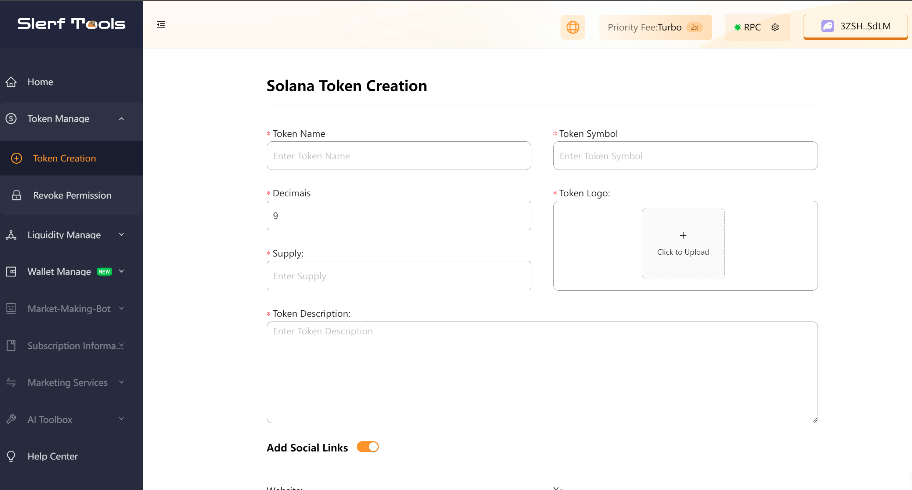
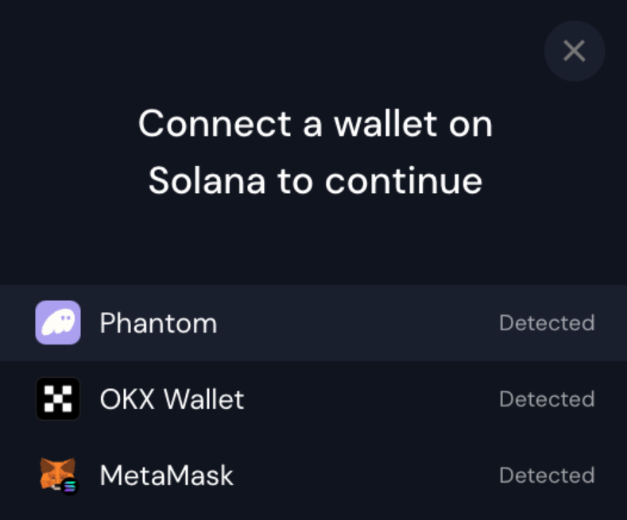
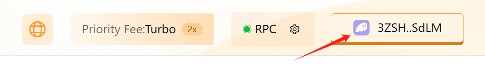
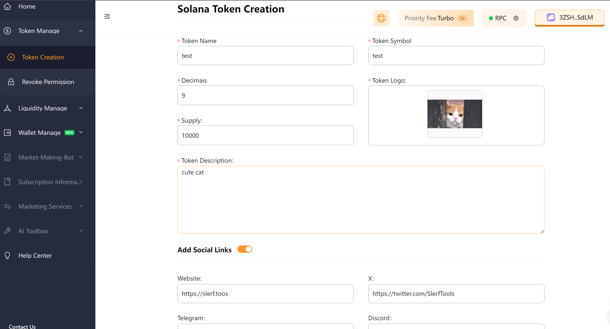
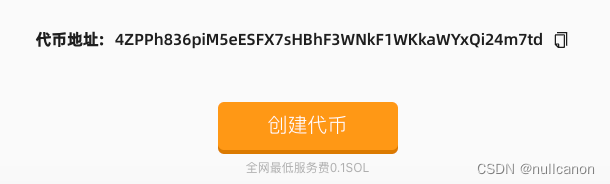
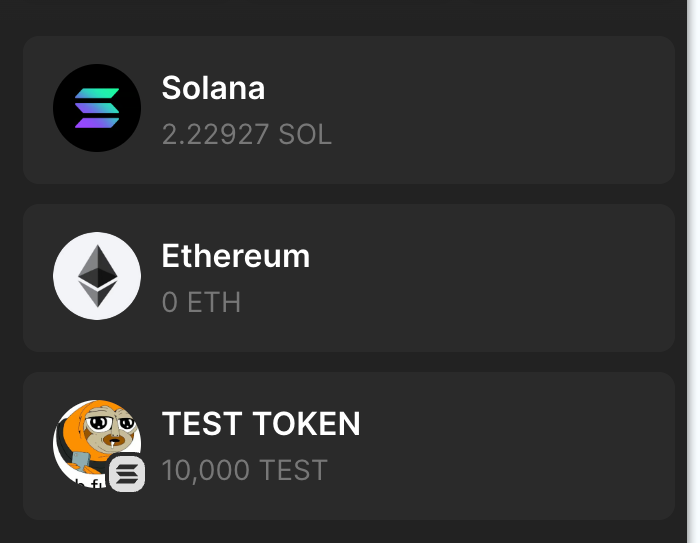
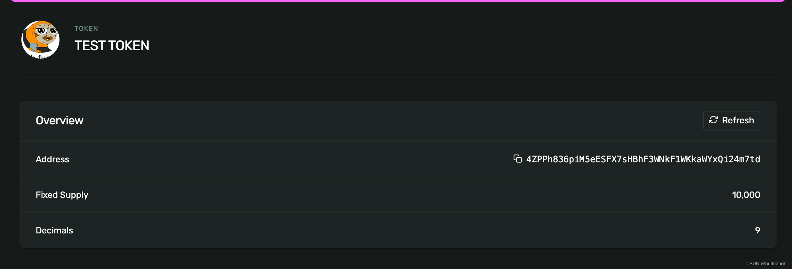

# Solana Token Creation Tutorial

Creating tokens on Solana is quick, convenient, and cost-effective. It only requires 0.13 SOL.

[SlerfTools-Solana Toolset](https://slerf.tools)

>We are committed to providing you with a secure and reliable platform that ensures your privacy is fully protected without causing any harm to your wallet. Our mission is **to be loyal to users** and **serve them**. We aim to establish a long-term and trustworthy relationship with our users.

You can create your own SOLANA token in just 1 minute.

1. Minimum wallet balance required: 0.15 SOL

2. Connect your Solana wallet.

3. Fill in token information and create.

4. Success! Token created.

Solana is a high-performance, decentralized smart contract platform based on blockchain technology. It aims to provide developers with highly scalable and low-cost blockchain infrastructure. With its innovative consensus mechanism and high-throughput network architecture, Solana achieves the processing capacity of thousands of transactions per second while maintaining low latency and low transaction costs, offering unparalleled blockchain experience for developers and users.

SLEFR founder and development team have jointly launched [SlerfTools](https://slerf.tools), a Solana toolbox with the lowest service fees in the network. With [SlerfTools](https://slerf.tools), you can issue SPL tokens on the Solana chain in just one minute.

- Connect Wallet.

- Upload Data.

- One-click token creation.

### 1.Connect your Solana wallet.
SlerfTools currently supports various popular Solana wallets such as Solflare, Phantom, and OK Wallet. In this article, we will use Phantom wallet as an example.
[Click here to access the tool](),  as shown in the image below:

Click on the "Select Wallet" button in the top right corner, and choose the wallet you are using from the pop-up window. Make sure the wallet has 0.15 SOL for payment:

After connecting, you will see the wallet address displayed in the top right corner.

### 2.Fill in Token Information and Create
Fill in the token details. Next, we will issue 10,000 tokens called "TEST" for testing purposes:

Once you have filled in the information, click on the "Create Token" button and follow the prompts to confirm the transaction in your wallet.

### 3.Successful Creation

After successful creation, you will see the token address at the bottom of the webpage:

## Frequently Asked Questions

### 1.  Do I need to open source the contract for token creation on Solana?
- Answer: No, it is not necessary. Tokens on Solana are created by using pre-established contracts provided by the official Solana team. All SPL20 tokens use the same contract.

### 2. Why is the wallet not displaying the logo?
- Answer: Sometimes, the information in the Phantom wallet may experience delays. Please be patient and wait for some time. You can also search for token information on the Solana browser.

### 3. Under what circumstances should permissions be discarded?
- Answer: In general, when adding a token to Raydium, you need to relinquish freeze and mint permissions. You can choose whether to relinquish metadata modification permissions. If you give up metadata permissions, the token's name and logo cannot be updated.

### 4. Is there a fee for uploading a logo?
- Answer: No, there is no fee. Our platform utilizes the IPFS storage solution, which is completely free of charge.