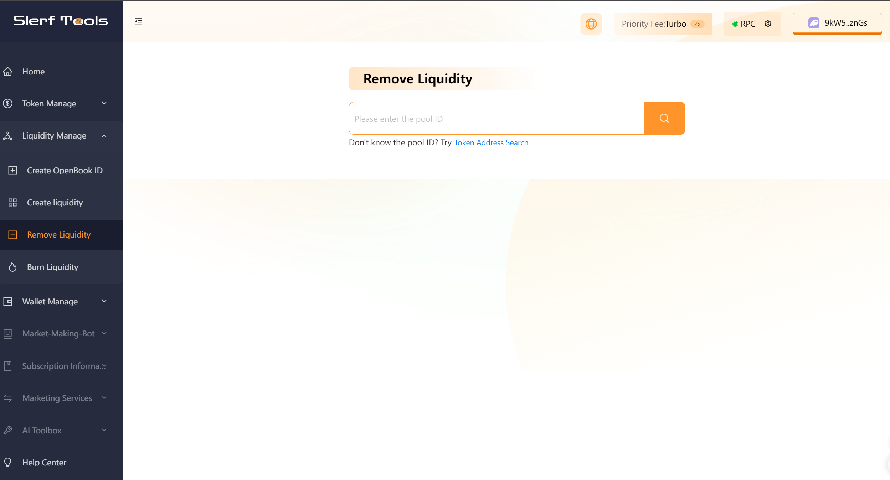
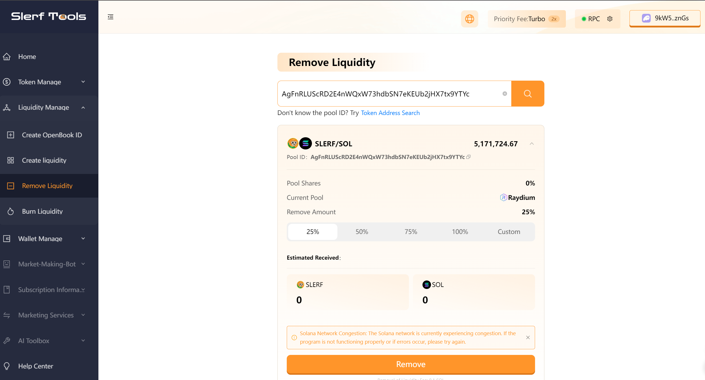

# How to remove a Raydium pool.

> We are committed to providing you with a secure and reliable platform that ensures your privacy is fully protected without causing any harm to your wallet. Our mission is to be loyal to users and serve them. We aim to establish a long-term and trustworthy relationship with our users.

### Why remove a pool on Raydium?

- Risk management: Withdrawing assets can be done for risk management purposes. If you believe there is uncertainty or an increased risk in the market or project, you may want to reduce your exposure to assets in the Raydium pool to protect your investment.

- Asset reallocation: You may wish to reallocate your asset allocation. Withdrawing assets can provide you with funds for reallocation in other pools, projects, or investments. This decision can be made based on changes in your investment strategy or market conditions.

- Profits extraction: When participating in liquidity mining or other liquidity-providing activities, you earn rewards or returns. By withdrawing assets, you can extract the accumulated profits or rewards from the Raydium pool to realize gains.

- Participation in other activities: Withdrawing assets can provide you with funds to participate in other activities or investments. You can use the funds for trading, investing in new projects, providing liquidity on other platforms, and more.

- Exiting Raydium: Withdrawing assets may also signify your decision to exit the Raydium platform or no longer participate in the activities it offers. This could be due to a decreased interest in the platform, changes in risk preferences, or other personal decisions.

### Next, let's demonstrate an example of removing a pool on the Solana blockchain.
Click [here](https://slerf.tools/liquidity-remover/solana)  to access the page for removing a pool, as shown in the following image.

Enter the Pool ID. If you don't have a Pool ID yet, you can click [here](https://slerf.tools/openbook-market/solana) to create an OpenBook ID first, and then click [here](https://slerf.tools/liquidity-creator/solana) to create liquidity (create a pool).

After entering the Pool ID, click on "Query" and wait for the query to complete. The pool information will be displayed once the query is finished.

Click on "Remove" to complete the liquidity removal process.

