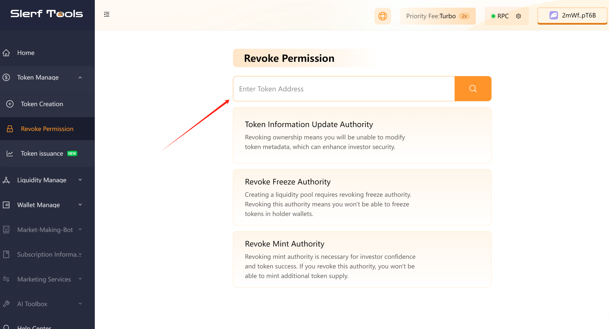
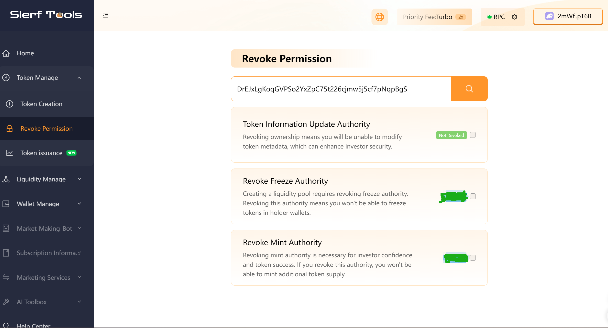
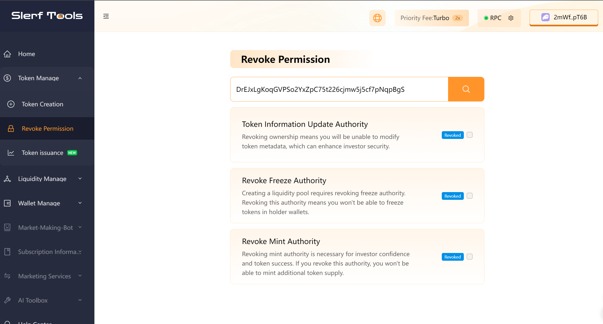

# How to Relinquish Token Permissions on the Solana Chain

>We are committed to providing you with a secure and reliable platform that ensures your privacy is fully protected without causing any harm to your wallet. Our mission is to be loyal to users and serve them. We aim to establish a long-term and trustworthy relationship with our users.

### How to Relinquish Token Permissions
First, open the permissions tool [Relinquish Permissions Page](https://slerf.tools/token/revoke), and then enter the token contract address as shown in the image below:

To input the contract address of the token you just created, please enter it in the input field for relinquishing permissions.

Token Address: DrEJxLgKoqGVPSo2YxZpC75t226cjmw5j5cf7pNqpBgS

Replace **Your Token Address** with the address of the token you created. If you haven't created a token yet, you can click on [this link](https://slerf.tools/token/create) to create one.

After clicking the query button, once the permission validation is completed, the following screen will appear.

Please follow these steps:

- Tick the boxes for relinquishing the token's metadata update permission, freeze permission, and mint permission.
- Click on the "Relinquish" button.
Wait for the website to prompt the wallet for a signature.
- Click on "Confirm Signature" to proceed.
Once the permission relinquishment is successful, you will see a screen similar to the image below. At this point, you have successfully relinquished the token permissions.

